# UML 图集 — AI Banking Agent 多智能体插件化银行系统

> **适用范围**：本文所有图形均依据 `src/` 下的真实源码绘制，类名、方法签名、文件路径与行号均可核对。
> **读者**：架构评审、开发、测试、合规。
> **相关文档**：[架构总览](../00-architecture/00-overview.md) · [C4 上下文](../00-architecture/01-c4-context.md) · [模块边界](../00-architecture/05-module-boundaries.md) · [架构决策记录](02-architecture-decision-record.md) · [接口契约](03-api-contract.md) · [数据模型](04-data-model.md)

---

## 0. 读图约定

### 0.1 渲染方式

本文全部使用 **Mermaid** 语法，GitHub / VS Code（Mermaid 插件）/ Typora 原生可渲染。

> **重要说明（不是缺陷，是事实）**：
> GitHub **不支持** Mermaid 的 C4 图语法（`C4Context` / `C4Container` / `C4Component`）。
> 因此本文的 a) b) c) 三张图用 `flowchart` 手工模拟 C4 的三层语义（边界框 = C4 Boundary，节点 = Container/Component），
> 以保证在任何 Markdown 环境下都能看到图。原始 PlantUML 版 C4 图见 [`../00-architecture/01-c4-context.md`](../00-architecture/01-c4-context.md)。

### 0.2 记号约定

| 记号 | 含义 |
|------|------|
| 实线箭头 `-->` | 依赖 / 调用方向 |
| 虚线箭头 `-.->` | 异步、事件、间接引用 |
| `<<interface>>` | 接口 |
| `<<abstract>>` | 抽象类 |
| `<<entity>>` | 2F Core 实体 |
| 分区框（`subgraph`） | 进程、程序集边界、数据库 Schema |

### 0.3 源码索引（本文引用的文件）

| 短名 | 路径 |
|------|------|
| SDK-Plugin | `src/src/BankingAgent.Plugin.Sdk/PluginContracts.cs` |
| SDK-Agent | `src/src/BankingAgent.Plugin.Sdk/AgentContracts.cs` |
| SDK-Event | `src/src/BankingAgent.Plugin.Sdk/EventContracts.cs` |
| SDK-CoreBank | `src/src/BankingAgent.Plugin.Sdk/CoreBankContracts.cs` |
| PluginRegistry | `src/src/BankingAgent.Base/Plugins/PluginRegistry.cs` |
| AgentRouter | `src/src/BankingAgent.Base/Agents/AgentRouter.cs` |
| AgentBase | `src/src/BankingAgent.Base/Agents/BankingAgentBase.cs` |
| SlotReader | `src/src/BankingAgent.Base/Agents/SlotReader.cs` |
| DbContext | `src/src/BankingAgent.Base/Data/BankingDbContext.cs` |
| BaseEntity | `src/src/BankingAgent.Base/Data/BaseEntity.cs` |
| UnitOfWork | `src/src/BankingAgent.Base/Data/UnitOfWork.cs` |
| SimpleFactory | `src/src/BankingAgent.Base/Data/SimpleDbContextFactory.cs` |
| EventBus | `src/src/BankingAgent.Base/Events/InMemoryEventBus.cs` |
| AuditLogger | `src/src/BankingAgent.Base/Security/Audit/AuditLogger.cs` |
| ComplianceGuard | `src/src/BankingAgent.Base/Security/Compliance/ComplianceGuard.cs` |
| ComplianceRules | `src/src/BankingAgent.Base/Security/Compliance/ComplianceRules.cs` |
| DataMasker | `src/src/BankingAgent.Base/Security/DataMasker.cs` |
| TokenService | `src/src/BankingAgent.Base/Security/Auth/TokenService.cs` |
| JwtOptions | `src/src/BankingAgent.Base/Security/Auth/JwtOptions.cs` |
| CoreBankClient | `src/src/BankingAgent.Base/CoreBank/CoreBankClient.cs` |
| DIExtensions | `src/src/BankingAgent.Base/BankingCoreServiceCollectionExtensions.cs` |
| Host | `src/src/BankingAgent.Host/Program.cs` |
| TransferPlugin | `src/plugins/BankingAgent.Plugin.Transfer/TransferPlugin.cs` |
| TransferAgent | `src/plugins/BankingAgent.Plugin.Transfer/TransferAgent.cs` |
| BillPlugin | `src/plugins/BankingAgent.Plugin.BillAnalysis/BillAnalysisPlugin.cs` |
| CardPlugin | `src/plugins/BankingAgent.Plugin.CardManagement/CardManagementPlugin.cs` |

---

## 1. 系统上下文图（C4 Context 语义）

系统边界：**AI 银行助手系统**（`BankingAgent.Host` + `BankingAgent.Base` + 插件目录）作为一个整体，与外部实体交互。

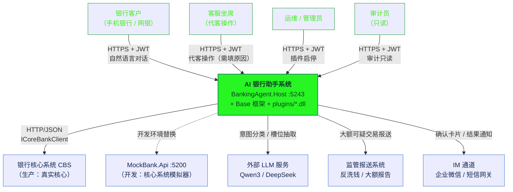

**图解**

| 关系 | 协议 | 源码落点 |
|------|------|----------|
| 客户 → 系统 | `POST /api/chat`、`POST /api/chat/confirm` | `Host/Program.cs:341`、`Host/Program.cs:418` |
| 客服代客 | 同上，且必须带 `impersonationReason` | `Host/Program.cs:357-393` |
| 运维启停插件 | `POST /api/plugins/{pluginId}/stop|start` | `Host/Program.cs:322`、`Host/Program.cs:331` |
| 系统 → CBS | `ICoreBankClient` 9 个方法 | `SDK-CoreBank.cs:8-24`，实现 `CoreBankClient.cs:28` |
| 系统 → LLM | **可选**（未配 `Ai:ApiKey` 时不调用）。意图识别由 `IIntentClassifier` 统一入口：配了密钥走 OpenAI 兼容模型，否则规则表 | `Base/Ai/LlmIntentClassifier.cs` |
| 系统 → 监管 | **当前未接入**。`AmlThresholdRule` 只打标不外发 | `ComplianceRules.cs:78-93` |
| 系统 → IM | **当前未接入**。人工确认靠前端轮询 `/api/chat/confirm` | — |

> **现状与目标的差距**（诚实记录，不粉饰）：
> 图中 6 个外部依赖里，只有 CBS/MockBank 与 IM 通道的**契约**已定义，
> LLM、监管报送、IM 推送三条链路**尚无代码**。这也是 [`03-api-contract.md`](03-api-contract.md) 里把 LLM 列为"规划"的原因。

---

## 2. 容器图（C4 Container 语义）

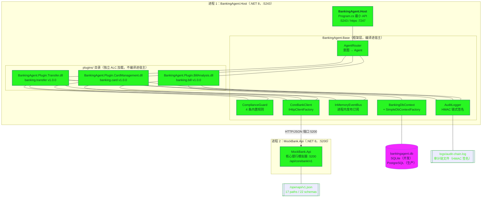

**图解**

| 容器 | 端口 | 技术 | 源码 | 备注 |
|------|------|------|------|------|
| `BankingAgent.Host` | `5243`（https `7247`） | ASP.NET Core 8 最小 API | `Host/Properties/launchSettings.json:16` | 唯一对外暴露的服务 |
| `MockBank.Api` | `5200` | ASP.NET Core 8 最小 API | `mock-bank/MockBank.Api/Properties/launchSettings.json:8` | 仅开发/演示环境 |
| 数据库 | — | SQLite / PostgreSQL | `Host/appsettings.json:10-14` | 默认 `Data Source=bankingagent.db` |
| 事件总线 | — | 进程内 | `EventBus.cs:12` | **不跨进程**，见 [ADR-020](02-architecture-decision-record.md#adr-020) |
| `plugins/` | — | 独立 `AssemblyLoadContext` | `PluginRegistry.cs:34` | 宿主构建后复制，**可独立发布** |

**插件如何进入 `plugins/` 目录**：Host 项目用 MSBuild 目标 `CopyPluginsToOutput` 在 `AfterTargets="Build"` 阶段把三个 `.dll` 复制到 `$(OutDir)plugins`
（`Host/BankingAgent.Host.csproj:22-32`）。`Plugins:Directory` 配置为空时回退到 `AppContext.BaseDirectory + "plugins"`（`Host/Program.cs:39-41`）。

**边界约束（架构铁律）**：

1. 插件**只**通过 `ICoreBankClient` 访问资金系统，**绝不**直接依赖 MockBank 的 DTO（`CoreBankClient.cs:1-3` 的注释即此约束）。
2. 插件**只**通过 `IEventPublisher` 与其他插件通信，**禁止**互相引用类型（`EventContracts.cs:1-2`）。
3. 插件**只**能写自己的数据分区（`IPluginContext.PartitionName`，`SDK-Plugin.cs:77`）。

---

## 3. 组件图（插件系统内部结构）

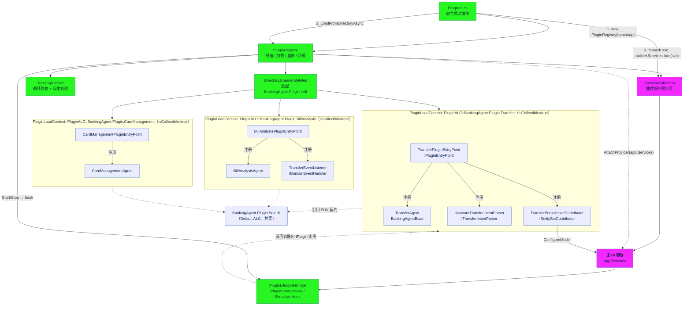

**图解**

这张图解释了 3 个关键机制：

### 3.1 每个插件一个可回收 ALC

`PluginLoadContext : AssemblyLoadContext`，构造时 `isCollectible: true`（`PluginRegistry.cs:28-38`）。
SDK 契约程序集名放进 `_sharedAssemblies`，`Load()` 命中就返回 `null` 交回 Default 上下文
（`PluginRegistry.cs:41-50`）—— 这是让**插件类型与宿主类型互转**能成立的前提，
否则同一个 `IPluginEntryPoint` 会在两个上下文里各有一份，DI 会直接抛 `InvalidCastException`。

### 3.2 加载期与构建期的时序

```
Program.cs
  ├─ builder.Services.AddBankingCore(...)              // 第 26 行
  ├─ var bootstrap = builder.Services.BuildServiceProvider()   // 第 31 行 ← 提前建一个临时容器
  ├─ new PluginRegistry(bootstrap, ...)               // 第 35 行
  ├─ await registry.LoadFromDirectoryAsync(pluginDir) // 第 42 行 ← 插件 ConfigureServices 写入 registry.Services
  ├─ foreach (svc in registry.Services) builder.Services.Add(svc)  // 第 47-50 行 ← 合并进主容器
  ├─ var app = builder.Build()                        // 第 55 行
  ├─ registry.AttachProvider(app.Services)            // 第 56 行 ← 启停钩子此时才有 provider
  └─ await bootstrap.DisposeAsync()                   // 第 57 行 ← 临时容器立即释放
```

为什么必须提前 `BuildServiceProvider()`？因为 `PluginRegistry` 构造时需要一个 `IServiceProvider` 作为
`IPluginContext.Services` 传给插件（`PluginRegistry.cs:86-94`、`PluginRegistry.cs:173`），
而插件的 `ConfigureServices` 又要执行才能拿到服务描述。详见 [ADR-019](02-architecture-decision-record.md#adr-019)。

### 3.3 依赖拓扑排序

`TopologicalSort` 用三色 DFS（`state`: 1=访问中、2=已完成）检测循环依赖，
并用 `PluginVersion.IsCompatible` 校验最低版本（`PluginRegistry.cs:269-308`）。
当前唯一的依赖边是 `banking.card → banking.transfer >= 1.0.0`（`CardPlugin.cs:31-34`）。
所有插件版本都是 1.0.0，实际无版本冲突。

---

## 4. 类图：插件契约层（`BankingAgent.Plugin.Sdk`）

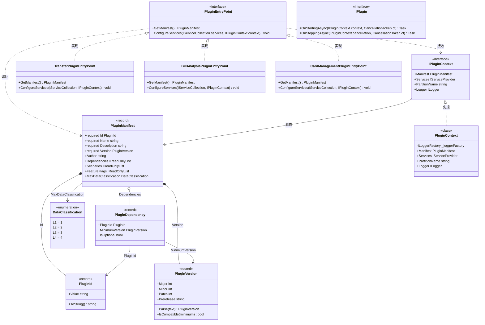

**图解**

| 元素 | 源码位置 | 关键设计 |
|------|----------|----------|
| `IPluginEntryPoint` | `SDK-Plugin.cs:92-98` | 每个插件程序集**必须且只能**实现一个；`PluginRegistry` 用 `FirstOrDefault` 查找（`PluginRegistry.cs:150-151`） |
| `IPluginContext` | `SDK-Plugin.cs:72-79` | 插件只读使用；`PartitionName` 是插件写数据的唯一授权范围 |
| `PluginManifest` | `SDK-Plugin.cs:42-56` | `required` 修饰的 `Id/Name/Description/Version` 强制初始化，纯元数据、不可变 |
| `PluginDependency` | `SDK-Plugin.cs:39` | `IsOptional=false` 的依赖在拓扑排序时**缺失即抛异常**（`PluginRegistry.cs:285-297`） |
| `PluginVersion.IsCompatible` | `SDK-Plugin.cs:29-32` | 主版本必须相同；`Patch` 相同才比较 `Prerelease`，属于简化版 SemVer |
| `IPlugin` | `SDK-Plugin.cs:82-89` | 生命周期钩子。**当前三个插件均未实现**（见文末"已知不一致"） |
| `PluginContext` | `PluginRegistry.cs:312-331` | `PartitionName` 把 `banking.transfer` 转成 `banking_transfer`（小写 + `.`→`_`），保证 SQL 标识符合法 |

**三个插件清单对照**（数据来自 `TransferPlugin.cs:23-34`、`BillPlugin.cs:18-29`、`CardPlugin.cs:19-35`）：

| 字段 | banking.transfer | banking.bill | banking.card |
|------|------------------|--------------|--------------|
| Name | 智能转账 | 账单分析 | 卡片管理 |
| Version | 1.0.0 | 1.0.0 | 1.0.0 |
| Author | 业务开发组 | AI 数据组 | 业务开发组 |
| Scenarios | `["transfer"]` | `["bill"]` | `["card"]` |
| FeatureFlags | `transfer.enabled`、`transfer.auto_confirm` | `bill.enabled`、`bill.trend_analysis` | `card.enabled`、`card.limit_adjust` |
| MaxDataClassification | L3 | L3 | L3 |
| Dependencies | 无 | 无 | `banking.transfer >= 1.0.0`（必需） |
| 注册的 Agent | `TransferAgent` | `BillAnalysisAgent` | `CardManagementAgent` |
| 数据分区 | `plugin_transfer` | 无（只读） | 无（不落库） |
| 事件订阅 | 无（是发布方） | `transfer.completed` | 无 |

> **一致性观察**：`IPluginContext.PartitionName` 推导出的名字是 `banking_transfer`，
> 而 `TransferPersistenceContributor.PartitionName` 硬编码为 `plugin_transfer`（`TransferPlugin.cs:70`）。
> **两个值不同**，前者用于日志标识，后者才是真正的 PostgreSQL Schema 名。见 [04-data-model.md](04-data-model.md#5-插件分区策略)。

---

## 5. 类图：Agent 体系

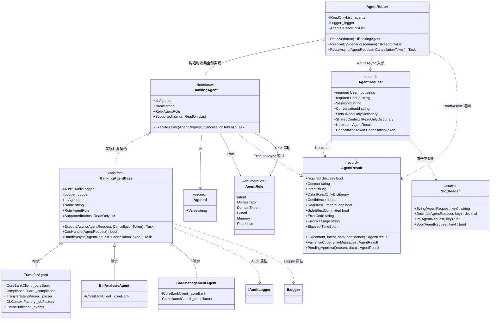

**图解**

### 5.1 三层职责切分

| 层 | 类型 | 职责 | 源码 |
|----|------|------|------|
| 契约 | `IBankingAgent` | 只声明"我是谁 + 我能处理什么意图 + 执行" | `SDK-Agent.cs:113-121` |
| 模板 | `BankingAgentBase` | 计时、审计、异常兜底、意图判定 `CanHandle` | `AgentBase.cs:12-110` |
| 路由 | `AgentRouter` | 意图 → Agent 的最长前缀匹配 | `AgentRouter.cs:11-61` |

`BankingAgentBase.ExecuteAsync` 是 **Template Method**：`HandleAsync` 是抽象钩子，
基类负责计时（`Stopwatch`）、写 `agent.execute` 审计、异常兜底转 `AGENT_EXCEPTION`（`AgentBase.cs:38-98`）。
子类只写业务，**不可能忘记审计**——这是模板方法在这个项目里最实际的价值。

### 5.2 `AgentResult` 的三态语义

| 工厂方法 | Success | RequiresHumanInLoop | SideEffectCommitted | 用途 |
|----------|:-------:|:-------------------:|:-------------------:|------|
| `Ok(...)` | true | false | false | 只读场景（查卡、查账单） |
| `PendingApproval(reason, data)` | **true** | **true** | **false** | 大额/可疑，等人工确认 |
| `Fail(code, msg)` | **false** | false | false | 合规拒绝、参数缺失、核心系统失败 |

`SideEffectCommitted` 是**最关键的安全标志**：客户端据此决定能否重试。
只要它是 `false`，重放请求就是安全的。见 [03-api-contract.md §5 幂等性契约](03-api-contract.md#5-幂等性契约)。

### 5.3 路由表（实测）

| Agent | Id | Role | SupportedIntents | 源码 |
|-------|----|------|------------------|------|
| 转账执行 Agent | `transfer.agent` | DomainExpert | `transfer`, `transfer.execute` | `TransferAgent.cs:48-57` |
| 账单分析 Agent | `bill.agent` | DomainExpert | `bill`, `bill.summary` | `BillPlugin.cs:54-63` |
| 卡片管理 Agent | `card.agent` | DomainExpert | `card`, `card.status` | `CardPlugin.cs:63-72` |

`AgentRole` 定义了 6 种角色（`SDK-Agent.cs:15-29`），但**当前只有 `DomainExpert` 被使用**。
`Intent` / `Orchestrator` / `Memory` / `Response` 对应的 Agent 尚未实现——
`DetectIntent`（`Host/Program.cs:502`）目前是一个静态方法而非可插拔 Agent，这是后续演进点。

### 5.4 路由规则与已知盲区

`Resolve` 的最长前缀逻辑（`AgentRouter.cs:27-39`）：

```
intent = "transfer.execute"
候选 A: TransferAgent，命中前缀 "transfer"（长度 8）
候选 B: TransferAgent，命中前缀 "transfer.execute"（长度 16）
OrderByDescending(Max(前缀长度)) → 选 B
```

`Resolve` 的已知盲区（`DetectIntent` 会产出但无 Agent 匹配，`AgentRouter.cs:53-57` 返回 `NO_AGENT`）：

| DetectIntent 产出 | 是否有 Agent 匹配 | 结果 |
|-------------------|:-----------------:|------|
| `transfer.execute` | ✅ `transfer` 前缀 | 转账 |
| `bill.summary` | ✅ `bill` 前缀 | 账单 |
| `card.list` | ✅ `card` 前缀 | 卡片 |
| `account.balance` | ❌ 无 `account` 前缀 | `NO_AGENT` |
| `unknown` | ❌ | `NO_AGENT` |

### 5.5 `SlotReader` 为什么必须存在

`AgentRequest.Slots` 是 `IReadOnlyDictionary<string, object?>`（`SDK-Agent.cs:39-40`）。
Minimal API 把 JSON 请求体反序列化成 `Dictionary<string, object?>` 时，**嵌套值是 `System.Text.Json.JsonElement` 而不是 `string`**。
插件 Agent 若直接 `(string)request.Slots["to_account"]` 会抛 `InvalidCastException`。

`SlotReader` 把这个坑集中处理了一遍（`SlotReader.cs:11-145`）：
支持 `string` / `int` / `long` / `decimal` / `double` / `bool` / 数字字符串 / `JsonElement`，
并且**捕获 `ObjectDisposedException`**——当 `JsonElement` 来自已释放的 `JsonDocument` 时降级为 `null` 而不是让整个请求 500。
详见 [ADR-013](02-architecture-decision-record.md#adr-013)。

---

## 6. 类图：安全与合规

```mermaid
classDiagram
    direction TB

    class IAuditLogger {
        <<interface>>
        +WriteAsync(AuditEvent, CancellationToken) Task
        +VerifyChain(IReadOnlyList) AuditChainVerification
    }

    class AuditLogger {
        +WriteAsync(AuditEvent, CancellationToken) Task
        +VerifyChain(IReadOnlyList) AuditChainVerification
        +SignAndAdvance(AuditEvent) AuditEvent
        +Sign(AuditEvent) AuditEvent
        +LastSignature string
        -AuditOptions _options
        -object _gate
        -SemaphoreSlim _fileGate
        -string _lastSignature
        -Canonicalize(AuditEvent, string) string
        -ComputeHmac(payload) string
        -AppendToFileAsync(AuditEvent, CancellationToken) Task
        -HashActor(actorId) string
    }

    class AuditEvent {
        <<record>>
        +required AuditId string
        +required Timestamp DateTimeOffset
        +required ActorType string
        +required ActorId string
        +required Operation string
        +Scenario string
        +Intent string
        +Decision string
        +DecisionReason string
        +RuleId string
        +RequestId string
        +TraceId string
        +SourcePlugin string
        +Amount decimal
        +RiskScore double
        +ComplianceRule string
        +ElapsedMs long
        +Extra IReadOnlyDictionary
        +Signature string
        +PreviousSignature string
    }

    class AuditChainVerification {
        <<record>>
        +IsValid bool
        +TotalRecords int
        +BrokenIndexes IReadOnlyList
    }

    class AuditOptions {
        +SigningKey string
        +EnableChainSignature bool
        +FilePath string
    }

    class ComplianceGuard {
        -IReadOnlyList _rules
        +Rules IReadOnlyList
        +Evaluate(ComplianceContext) ComplianceDecision
    }

    class IComplianceRule {
        <<interface>>
        +RuleId string
        +RuleVersion string
        +Scenarios IReadOnlyList
        +Evaluate(ComplianceContext) ComplianceDecision
    }

    class ComplianceDecision {
        <<record>>
        +required Allowed bool
        +RuleId string
        +RuleVersion string
        +Reason string
        +RequiresHumanApproval bool
        +RiskScore double
        +Allow(ruleId) ComplianceDecision
        +Deny(ruleId, reason) ComplianceDecision
        +RequireApproval(ruleId, reason, riskScore) ComplianceDecision
    }

    class ComplianceContext {
        <<record>>
        +required UserId string
        +required Scenario string
        +Intent string
        +Amount decimal
        +SourceAccount string
        +TargetAccount string
        +IdempotencyKey string
        +Extra IReadOnlyDictionary
    }

    class ComplianceOptions {
        +TransferAutoApproveLimit decimal
        +TransferDailyLimit decimal
        +AmlReportThreshold decimal
        +TransferHardCap decimal
        +HighFrequencyThreshold int
    }

    class TransferAmountRule {
        +RuleId string
        +RuleVersion string
        +Scenarios IReadOnlyList
        +Evaluate(ComplianceContext) ComplianceDecision
    }

    class SelfTransferRule {
        +RuleId string
        +RuleVersion string
        +Scenarios IReadOnlyList
        +Evaluate(ComplianceContext) ComplianceDecision
    }

    class AmlThresholdRule {
        +RuleId string
        +RuleVersion string
        +Scenarios IReadOnlyList
        +Evaluate(ComplianceContext) ComplianceDecision
    }

    class ScenarioPermissionRule {
        +RuleId string
        +RuleVersion string
        +Scenarios IReadOnlyList
        +Evaluate(ComplianceContext) ComplianceDecision
    }

    class DataMasker {
        <<static>>
        +MaskPhone(phone) string
        +MaskIdCard(idCard) string
        +MaskBankCard(cardNo) string
        +MaskName(name) string
        +MaskEmail(email) string
        +MaskAccount(accountNo) string
        +Apply(value, DataClassification, fieldKind) string
        +MaskGraph(input, DataClassification) object
    }

    class ITokenService {
        <<interface>>
        +IssueToken(userId, role, displayName) string
        +Validate(token) CurrentPrincipal
    }

    class TokenService {
        -JwtOptions _options
        -ILogger _logger
        -SymmetricSecurityKey _key
        +IssueToken(userId, role, displayName) string
        +Validate(token) CurrentPrincipal
    }

    class JwtOptions {
        +SigningKey string
        +Issuer string
        +Audience string
        +ExpirationMinutes int
        +AllowDevelopmentKey bool
    }

    class CurrentPrincipal {
        +UserId string
        +Role string
        +DisplayName string
        +IsAuthenticated bool
        +CanAudit bool
        +CanAdminister bool
        +CanImpersonateSupport bool
    }

    class JwtRoles {
        <<static>>
        User
        Agent
        Staff
        Auditor
        Admin
    }

    IAuditLogger <|.. AuditLogger : 实现
    AuditLogger --> AuditEvent : 签名对象
    AuditLogger --> AuditOptions : 配置
    AuditLogger ..> AuditChainVerification : 校验返回
    IComplianceRule <|.. TransferAmountRule : 实现
    IComplianceRule <|.. SelfTransferRule : 实现
    IComplianceRule <|.. AmlThresholdRule : 实现
    IComplianceRule <|.. ScenarioPermissionRule : 实现
    ComplianceGuard o-- IComplianceRule : 构造注入全部规则
    IComplianceRule ..> ComplianceContext : 入参
    IComplianceRule ..> ComplianceDecision : 返回 null 表示不适用
    ComplianceGuard ..> ComplianceContext : 构造入参
    ComplianceGuard ..> ComplianceDecision : 返回
    ComplianceOptions ..> TransferAmountRule : 构造注入阈值
    ComplianceOptions ..> AmlThresholdRule : 构造注入阈值
    ITokenService <|.. TokenService : 实现
    TokenService --> JwtOptions : 配置
    TokenService ..> CurrentPrincipal : 返回
    TokenService ..> JwtRoles : 角色常量
    CurrentPrincipal --> JwtRoles : 角色常量
    TransferAgent --> ComplianceGuard : 依赖
    TransferAgent --> IAuditLogger : 经 BankingAgentBase.Audit
    CardManagementAgent --> ComplianceGuard : 依赖
    BillAnalysisAgent --> DataMasker : 脱敏
    CardManagementAgent --> DataMasker : 脱敏
    TokenService --> CurrentPrincipal : 供鉴权中间件使用
```

**图解**

### 6.1 审计链的三个不变量

| 不变量 | 代码保障 | 位置 |
|--------|----------|------|
| 任何篡改都会导致链断裂 | 每条记录的 HMAC 输入包含**前一条的签名** | `AuditLogger.cs:160-174` `Canonicalize` 第 10 段 `previousSignature` |
| 读链尾 / 算签名 / 写链尾是原子的 | 三步在同一个 `lock (_gate)` 临界区内 | `AuditLogger.cs:98-114` `SignAndAdvance` |
| 并发写文件不会撕裂行 | `_fileGate` SemaphoreSlim 串行化文件追加 | `AuditLogger.cs:210-218` |
| 审计文件不泄露用户身份 | `HashActor` 取 SHA-256 前 12 个十六进制字符 | `AuditLogger.cs:228-232` |
| 审计写失败必须告警 | `LogCritical` 而不是吞异常 | `AuditLogger.cs:220-224` |

`SignAndAdvance` 与 `Sign` 的区别就是 ADR-015 的全部内容：
`Sign` **只算不推进**（供离线校验与单元测试用，`AuditLogger.cs:117-131`），
`SignAndAdvance` **算完立即推进链尾**（生产路径，`AuditLogger.cs:98-114`）。
早期实现把这两步拆开，导致并发写入时两条记录引用同一个 `PreviousSignature`，链直接断裂。

### 6.2 四条合规规则

| RuleId | 版本 | 适用场景 | 行为 | 阈值来源 |
|--------|------|----------|------|----------|
| `transfer.amount.threshold` | v1.5 | `transfer` | ≤0 拒绝；>硬上限拒绝；>自动放行上限需人工 | `TransferAutoApproveLimit` / `TransferHardCap` |
| `transfer.self` | v1.0 | `transfer` | 账户信息不全拒绝；自转拒绝 | 无 |
| `aml.large_amount` | v1.2 | `transfer`, `wealth` | ≥ 反洗钱阈值要求人工复核 | `AmlReportThreshold` |
| `scenario.permission` | v1.0 | 全部（`Scenarios` 为空） | 非资金场景 + `Amount > 0` 拒绝 | 无 |

**求值语义（`ComplianceGuard.Evaluate`，`ComplianceGuard.cs:64-89`）**：

```
for rule in _rules:                    # 注册顺序即执行顺序
    if rule.Scenarios 非空 且 不含 ctx.Scenario: continue
    decision = rule.Evaluate(ctx)
    if decision is null: continue      # 该规则对此场景不适用
    if not decision.Allowed: return decision    # 拒绝 → 立即返回
    if decision.RequiresHumanApproval: return decision  # 需人工 → 立即返回
return ComplianceDecision.Allow()
```

即**短路语义**：第一条"拒绝"或"需人工"的规则决定结果，后续规则不再执行。
`RequiresHumanApproval` 不是 `Allowed = false`，而是"放行但要求人工"。

> **规则顺序的隐含风险**：`TransferAmountRule`（要求人工）先于 `AmlThresholdRule`（要求人工）执行，
> 30,000 元的转账只会命中第一条，返回的 `RuleId` 是 `transfer.amount.threshold`，
> **反洗钱规则不会被记录**。但 `RiskScore` 仍会写审计（`TransferAgent.cs:115`），
> 且合规模板里也声明了场景，合规视角可接受。改造方案见 [ADR-020 备注](02-architecture-decision-record.md#adr-020)。

### 6.3 四个配置项中两个**当前未被任何规则消费**

| 配置项 | 默认值 | 是否被规则读取 | 位置 |
|--------|--------|:--------------:|------|
| `TransferAutoApproveLimit` | 5000 | ✅ | `ComplianceRules.cs:45` |
| `AmlReportThreshold` | 50000 | ✅ | `ComplianceRules.cs:86` |
| `TransferHardCap` | 500000 | ✅ | `ComplianceRules.cs:38` |
| `TransferDailyLimit` | 200000 | ❌ **未被读取** | 配置在 `Host/appsettings.json:33`，无规则引用 |
| `HighFrequencyThreshold` | 5 | ❌ **未被读取** | 配置在 `Host/appsettings.json:36`，无规则引用 |

单日限额目前由 MockBank 的 `DAILY_LIMIT_EXCEEDED` 兜底（`ErrorContracts.cs:44`），
频率风控**没有实现**。这是有意的范围裁剪，记录在此以免误判为已完成。

### 6.4 脱敏策略矩阵

`DataMasker.Apply(value, level, fieldKind)`（`DataMasker.cs:79-97`）：

| 级别 | 行为 |
|------|------|
| L1 公开 | 原样返回 |
| L4 绝密 | 一律返回 `"********"` |
| L2 / L3 | 按 `fieldKind` 分派到具体脱敏函数 |

`fieldKind` 分派表（`DataMasker.cs:86-95`）：

| fieldKind | 函数 | 输出示例 |
|-----------|------|----------|
| `phone` | `MaskPhone` | `138****8000` |
| `idcard` / `id` | `MaskIdCard` | `110101********1234` |
| `card` / `cardno` / `bankcard` | `MaskBankCard` | `**** **** **** 0001` |
| `account` / `accountno` | `MaskAccount` | `************0001` |
| `name` | `MaskName` | `张*` |
| `email` | `MaskEmail` | `z***@example.com` |
| 其他 | `MaskAccount`（保守默认） | 掩码 |

`MaskGraph` 递归处理对象图，**字典会把键名传给值**以实现字段感知脱敏
（`DataMasker.cs:109-113`，注释明确说明"否则 phone 字段会被当成 generic 走账号掩码"），
这正是 LLM 上下文中防止敏感字段外泄的关键路径。

### 6.5 鉴权能力矩阵

`CurrentPrincipal`（`JwtOptions.cs:39-54`）：

| 属性 | 判定 | 覆盖角色 |
|------|------|----------|
| `CanAudit` | `Role is auditor or admin` | 审计员、管理员 |
| `CanAdminister` | `Role == admin` | 仅管理员 |
| `CanImpersonateSupport` | `Role is staff or auditor or admin` | 客服、审计员、管理员 |

`TokenService` 在**构造时**校验密钥长度 ≥ 32 字节，不足直接抛 `InvalidOperationException`（`TokenService.cs:27-31`）——
这是把配置错误拦在启动期而不是运行期的典型做法。
`Validate` 关闭了详细异常信息，只记录 `ex.GetType().Name`，避免日志泄露凭证（`TokenService.cs:123-127`）。

---

## 7. 类图：数据访问层

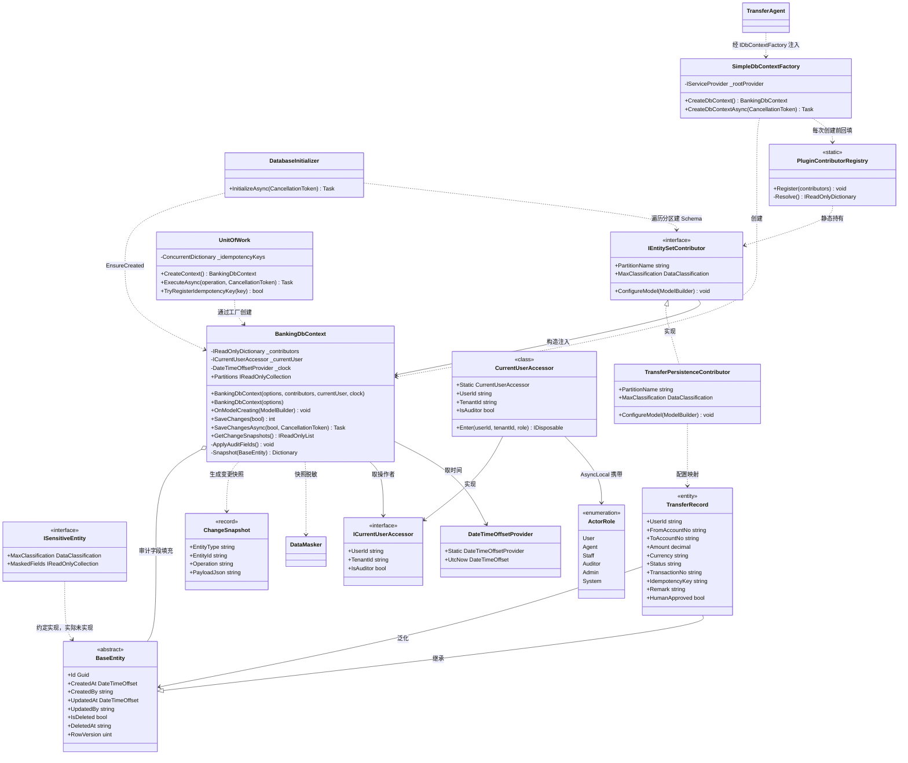

**图解**

### 7.1 实体继承树

当前**只有一张业务表**：`transfer_records`（`TransferPlugin.cs:78`）。
其余两个插件不落库（`BillAnalysisPlugin` 只读核心系统、`CardManagementPlugin` 直接调核心系统）。
本文档如实反映这一点，不虚构表。

```
BaseEntity（抽象，9 个字段，全部带审计语义）
  └── TransferRecord（+10 个业务字段）
        映射到表 transfer_records，索引 2 个
```

### 7.2 `BankingDbContext` 的双构造函数（本项目最反直觉的设计）

| 构造函数 | 参数 | 何时被调用 | 依赖来源 |
|----------|------|------------|----------|
| 主构造函数（4 参） | `options, contributors, currentUser, clock` | DI 容器直接解析 `BankingDbContext`（Scoped） | 容器注入 |
| 最小构造函数（1 参） | `options` | `IDbContextFactory.CreateDbContext()` 路径 | 贡献器来自 `PluginContributorRegistry` 静态表；用户与时钟用 `.Static` 单例 |

存在两个构造函数的原因：2F Core 内置的 `IDbContextFactory<T>` 只会找"接受 `DbContextOptions` 的唯一构造函数"，
而项目的 DbContext 需要注入插件贡献器集合、当前用户、时钟。见
[ADR-011](02-architecture-decision-record.md#adr-011) 与 `SimpleDbContextFactory.cs:1-6` 的注释。

`SimpleDbContextFactory.CreateDbContext` 的做法是：从根容器 `GetServices<IEntitySetContributor>()` 取出贡献器，
**先写进静态注册表**（`SimpleDbContextFactory.cs:22-23`），再调主构造函数。
代价是每次创建 DbContext 都会重写一次进程级静态状态，详见 [ADR-012](02-architecture-decision-record.md#adr-012)。

### 7.3 审计字段自动填充

`ApplyAuditFields`（`BankingDbContext.cs:95-118`）在**每次 SaveChanges 前**执行：

| 实体状态 | 动作 |
|----------|------|
| `Added` | 写 `CreatedAt = _clock.UtcNow`、`CreatedBy = 当前用户或 "system"` |
| `Modified` | 写 `UpdatedAt`、`UpdatedBy`；**强制 `CreatedAt`/`CreatedBy` 的 `IsModified = false`** |
| `Deleted` | **不处理**（见下方不一致清单） |

`IsModified = false` 那一行是安全关键：防止业务代码在更新实体时顺手改掉创建信息（`BankingDbContext.cs:112-114`）。

### 7.4 `UnitOfWork` 的事务边界

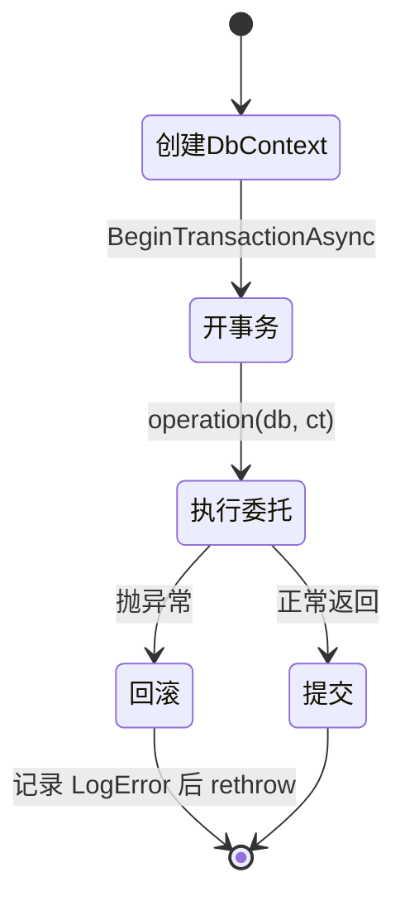

`ExecuteAsync` 的 catch 分支 `LogError` + `Rollback` + **rethrow**（`UnitOfWork.cs:29-34`），
不吞异常——这是正确的：静默吞掉会导致调用方以为转账成功了。

`TryRegisterIdempotencyKey` 用 `ConcurrentDictionary.TryAdd` 实现进程内去重，
并发下**恰好一个**成功（`UnitOfWork.cs:44-48`，单元测试 `IdempotencyTests.cs:51-62` 验证了 100 并发只有 1 次成功）。
但 `UnitOfWork` 注册为 **Scoped**（`DIExtensions.cs:115`），每次请求都是新实例，
所以这个字典实际只在单个请求内有效——真正的幂等保护在 `TransferRecord.IdempotencyKey` 的**唯一索引**上。

---

## 8. 时序图：一次带人工确认的转账

**场景**：用户 `u_demo01` 要转 30,000 元给 `6E2E020200000003`，超过自动放行上限 5,000 元，触发人工确认。

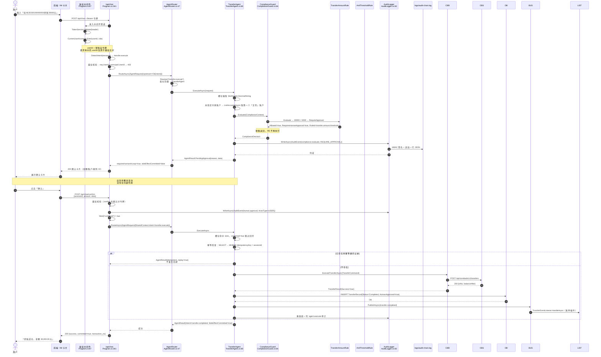

**图解**

### 8.1 完整链路核对表

| 步骤 | 代码位置 | 安全要点 |
|------|----------|----------|
| 1. 鉴权 | `Host/Program.cs:87-117` | 令牌无效 → 401；白名单只有 `/health` 与 `/api/auth/token`（`Host/Program.cs:486-489`） |
| 2. 身份落地 | `Host/Program.cs:97` | `CurrentUserAccessor.Enter` 写 AsyncLocal，让审计字段拿到真实用户 |
| 3. 意图识别 | `Base/Ai/LlmIntentClassifier.cs` | 默认规则表（插件自报关键词）；配 `Ai:ApiKey` 后由大模型判定，失败自动降级 |
| 4. 越权防护 | `Host/Program.cs:353-373` | `effectiveUserId = principal.UserId`，请求体 userId 仅用于比对 |
| 5. 路由 | `AgentRouter.cs:27-39` | 最长前缀优先 |
| 6. 槽位抽取 | `TransferAgent.cs:63-66` + `SlotReader.cs:14-126` | 统一处理 JsonElement |
| 7. 补全付款账户 | `TransferAgent.cs:81-87` | 调 `ICoreBankClient.ListAccountsAsync`，取 `Status == "正常"` 的第一个 |
| 8. 合规评估 | `TransferAgent.cs:91-100` | 幂等键 `IdempotencyKey = request.SessionId` 也传进合规上下文 |
| 9. 审计合规决策 | `TransferAgent.cs:102-117` | `ActorType = "AGENT"`，`RiskScore` 入审计 |
| 10. 人工回环 | `TransferAgent.cs:126-138` | `RequiresHumanApproval && !confirmed` → `PendingApproval`，**此时 `SideEffectCommitted` 必为 false** |
| 11. 幂等检查 | `TransferAgent.cs:141-163` | 命中则返回原结果，`idempotent_replay = true` |
| 12. 调核心 | `TransferAgent.cs:166-174` | 只经 `ICoreBankClient`，插件不感知 HTTP |
| 13. 失败审计 | `TransferAgent.cs:178-189` | `ActorType = "CORE_BANK"`，`Decision = "FAILED"` |
| 14. 落库 | `TransferAgent.cs:196-209` | `Status = "Completed"`，`HumanApproved = compliance.RequiresHumanApproval` |
| 15. 发事件 | `TransferAgent.cs:212-228` | `EventType = "transfer.completed"`，`CorrelationId = SessionId` |
| 16. 统一审计 | `AgentBase.cs:53-66` | 模板方法保证每个 Agent 执行都留痕 |
| 17. 确认端点 | `Host/Program.cs:418-471` | 也做越权校验（`Host/Program.cs:427-432`） |

### 8.2 三条安全不变量

1. **`SideEffectCommitted == false` 时余额一定没动**：第 10 步直接 `return`，第 12 步的 `ExecuteTransferAsync` 根本没被调用。E2E 测试 `Program.cs:257` 断言了"等待确认期间余额未变"。
2. **人工确认必须由令牌身份发起**：第 17 步，`userId` 取 `principal.UserId`（`Host/Program.cs:434`），不能代客确认除非有 `CanImpersonateSupport`。
3. **确认动作本身留痕**：`human.approval` 审计带 `ActorType = "USER"` 与 `Amount`（`Host/Program.cs:436-448`）。

### 8.3 幂等的真实保护点与竞态

`TransferAgent` 的幂等检查是**先查后写**：

```
① SELECT ... WHERE IdempotencyKey = sessionId     ← TransferAgent.cs:144
② POST /transfers 到核心系统                        ← TransferAgent.cs:166
③ INSERT TransferRecord                             ← TransferAgent.cs:208
```

**①②③ 之间没有事务、也没有分布式锁**，且 ② ③ 顺序不可调换（先扣款才知道流水号）。
两个并发请求用同一个 `sessionId` 时，**可能都通过 ① 然后都执行 ②**。
唯一索引 `entity.HasIndex(e => e.IdempotencyKey).IsUnique()`（`TransferPlugin.cs:83`）只能拦住"两次都走到 ③"的情况，
而此时**核心系统已经扣了两次款**。

更根本的问题：`CoreBankClient.ExecuteTransferAsync` 组装请求体时**没有发送 `cmd.IdempotencyKey`**
（`CoreBankClient.cs:63-71` 只有 userId / fromAccountNo / toAccountNo / amount / currency / remark），
所以 CBS 侧也没有第二道防线。完整分析与迁移方案见
[ADR-021](02-architecture-decision-record.md#adr-021)。

---

## 9. 时序图：插件热加载与热插拔

**场景**：宿主启动时扫描 `plugins/`，加载 3 个插件；随后管理员停用 `banking.card`。

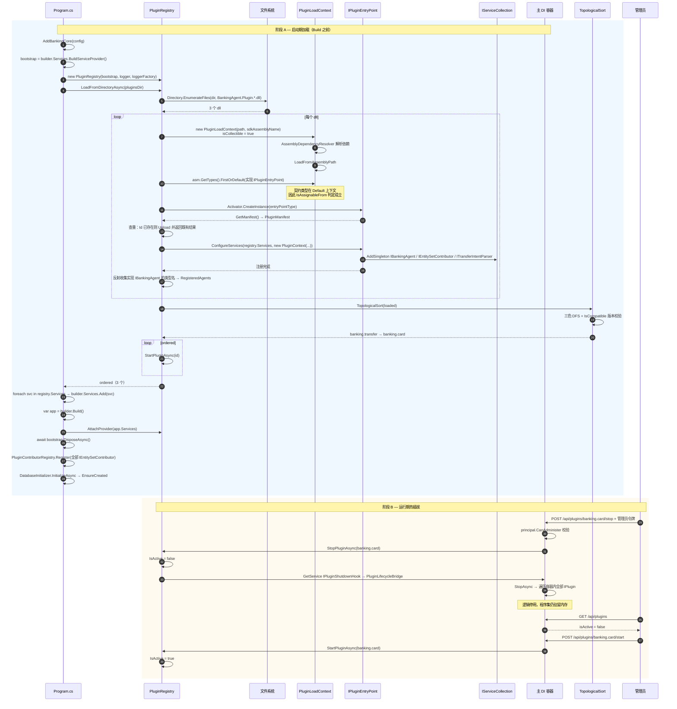

**图解**

### 9.1 加载流程的关键约束

| 约束 | 代码 | 违反后果 |
|------|------|----------|
| SDK 契约必须走 Default 上下文 | `PluginRegistry.cs:37`、`PluginRegistry.cs:43-46` | 类型无法互转，DI 抛 `InvalidCastException` |
| 插件文件名必须匹配 `BankingAgent.Plugin.*.dll` | `PluginRegistry.cs:119` | 插件被静默忽略 |
| `.Plugin.Sdk` 后缀要显式排除 | `PluginRegistry.cs:122` | SDK 程序集被当成插件重复加载 |
| 同一程序集只能有一个 `IPluginEntryPoint` 实现 | `PluginRegistry.cs:150-151` 取 `FirstOrDefault` | 第二个实现被静默忽略 |
| `PluginId` 全局唯一 | `PluginRegistry.cs:163-171` | 重复加载被跳过并打 Warning |
| 非可选依赖必须存在且版本兼容 | `PluginRegistry.cs:285-297` | 抛 `InvalidOperationException`，该插件加载失败 |
| 插件服务必须静态注册（DI 友好） | 三个插件全用 `AddSingleton` | 捕获依赖（scoped 服务）会抛异常 |

### 9.2 停用 / 启动 / 卸载三种操作的区别

| 操作 | API | 程序集是否驻留 | ALC 是否可回收 | 幂等性 |
|------|-----|:--------------:|:---------------:|--------|
| 停用 `StopPluginAsync` | `POST /api/plugins/{id}/stop` | 是 | 否 | 已停用时再调返回 `true` |
| 启动 `StartPluginAsync` | `POST /api/plugins/{id}/start` | 是 | 否 | 已启动时返回 `true` |
| 卸载 `UnloadPlugin` | **无 HTTP 端点** | 否 | 是（`alc.Unload()`） | 运行中调用返回 `false` 并告警 |

`UnloadPlugin` 只能在代码里调用（`PluginRegistry.cs:248-266`），当前**没有暴露 HTTP 端点**，
这意味着"真热更新"（换 dll 再加载）在当前版本做不到。`LoadFromDirectoryAsync` 也只在启动时调用一次。

### 9.3 启动钩子当前不会触发（重要发现）

`PluginLoadResult.IsActive` 的**默认值是 `true`**（`PluginRegistry.cs:24`），
而 `StartPluginAsync` 的第一句就是 `if (plugin.IsActive) return true;`（`PluginRegistry.cs:209`）。

推论：`LoadFromDirectoryAsync` 末尾的 `await StartPluginAsync(...)`（`PluginRegistry.cs:136-139`）
与 `Program.cs:75-78` 的循环，**两次都会在这里直接返回**，`IPluginStartupHook.StartAsync` 从未被调用。
`PluginLifecycleBridge.StartAsync`（`Host/Program.cs:570-576`）是死代码。

当前三个插件都没有实现 `IPlugin`（`SDK-Plugin.cs:82-89`），所以**没有可观察到的功能影响**；
但一旦有插件需要在 `OnStartingAsync` 里订阅事件或启动后台任务，它会静默不执行。
只有"先 stop 再 start"的路径才会真正触发钩子（因为此时 `IsActive` 为 `false`）。

修复方案（未实施，属于遗留项）：在 `LoadAsync` 构造 `PluginLoadResult` 时显式 `IsActive = false`。
详见 [ADR-022 建议](02-architecture-decision-record.md)（本文不新增 ADR 编号，此处仅作标注）。

---

## 10. 状态图：转账生命周期

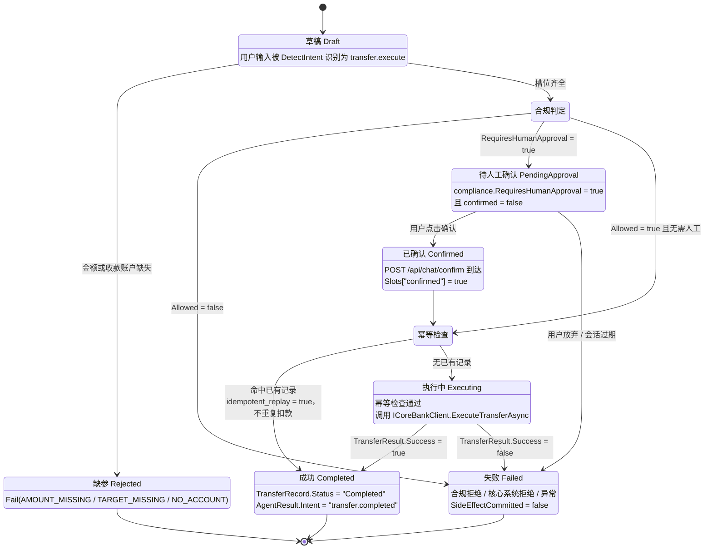

**图解**

### 10.1 状态与代码的对应关系（区分"设计态"与"持久化态"）

| 状态 | 是否写入 `TransferRecord.Status` | 承载物 | 源码 |
|------|:-------------------------------:|--------|------|
| 草稿 Draft | ❌ | 请求刚进来 | `Host/Program.cs:341` |
| 缺参 Rejected | ❌ | `AgentResult.Fail` | `TransferAgent.cs:70`、`:75`、`:85` |
| 待人工确认 | ❌ **不落库** | `AgentResult.PendingApproval` | `TransferAgent.cs:129-137` |
| 已确认 | ❌ **不落库** | `Slots["confirmed"] = true` | `Host/Program.cs:450` |
| 执行中 | ❌ **不落库** | 方法调用栈 | `TransferAgent.cs:166-174` |
| 成功 | ✅ `"Completed"` | `TransferRecord` | `TransferAgent.cs:202` |
| 失败 | ❌ | `AgentResult.Fail` | `TransferAgent.cs:122`、`:191` |

> **必须诚实说明的现状**：
> `BaseEntity` 定义了 `IsDeleted` / `DeletedAt`（`BaseEntity.cs:17-18`），
> `TransferRecord.Status` 的**默认值是 `"Pending"`**（`TransferPlugin.cs:60`），
> 但代码里**从来没有写入过 `"Pending"`** —— 记录只在成功路径创建并直接写 `"Completed"`。
> 所以数据库里只可能出现两种状态：没有记录（= 草稿/待确认/执行中/失败）或有记录且 `Status = "Completed"`。
>
> 也就是说：**上图中除"成功"外的所有状态目前都只存在于内存中，进程重启即丢失**。
> 后果是用户提交确认后如果宿主崩溃，幂等键失效，无法恢复进行中的转账。
> 持久化状态机的改造方案属于待办，见 [04-data-model.md §9 已知缺口](04-data-model.md#9-已知缺口与改进项)。

### 10.2 每个终态的对外表现

| 终态 | `success` | `requiresHumanInLoop` | `sideEffectCommitted` | `errorCode` | HTTP |
|------|:---------:|:---------------------:|:---------------------:|-------------|------|
| 缺参 | false | false | false | `AMOUNT_MISSING` / `TARGET_MISSING` / `NO_ACCOUNT` | 200 |
| 待人工确认 | **true** | **true** | **false** | null | 200 |
| 成功 | true | false | **true** | null | 200 |
| 合规失败 | false | false | false | `COMPLIANCE_REJECTED` | 200 |
| 核心系统失败 | false | false | false | `INSUFFICIENT_FUNDS` 等（透传） | 200 |
| Agent 异常 | false | false | false | `AGENT_EXCEPTION` | 200 |
| 无匹配 Agent | false | false | false | `NO_AGENT` | 200 |

> **注意**：业务失败**也返回 HTTP 200**。
> 客户端必须检查响应体里的 `success` 字段，不能只看状态码。
> 完整错误码表见 [03-api-contract.md §3](03-api-contract.md#3-错误码全表)。

---

## 11. 部署图（单环境，演示拓扑）

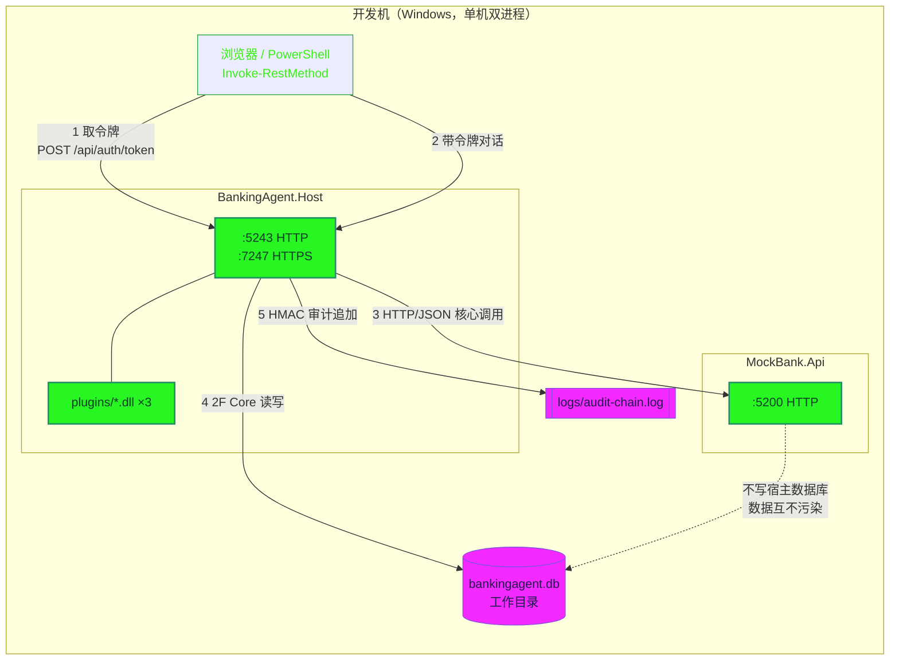

**图解**

| 事项 | 现状 | 生产化要求 |
|------|------|------------|
| 端口 | Host `5243/7247`、MockBank `5200` | 统一走网关（HTTPS + mTLS） |
| 数据库 | SQLite 单文件 | PostgreSQL 16，建 `plugin_*` Schema |
| 审计 | 本地文件 + 日志 | 独立审计库 + WORM 存储 / 审计网关 |
| 密钥 | `dev-only-*` 写在 `appsettings.json` | 环境变量 `Jwt__SigningKey` / `Audit__SigningKey` 注入 |
| 插件 | 编译后复制到 `OutDir/plugins` | 独立发布包 + 签名校验 + 灰度装载 |
| 进程 | 单实例 | 无状态化后可多实例（需先解决事件总线跨进程，见 [ADR-020](02-architecture-decision-record.md#adr-020)） |

---

## 12. 图表索引

| # | 图名 | 类型 | 主要回答的问题 |
|---|------|------|----------------|
| 1 | 系统上下文图 | flowchart（C4 语义） | 系统和谁交互、边界在哪 |
| 2 | 容器图 | flowchart（C4 语义） | 有几个可部署单元、端口多少 |
| 3 | 组件图（插件系统） | flowchart | 插件怎么进 DI、ALC 怎么隔离 |
| 4 | 类图：插件契约 | classDiagram | 插件作者要实现哪几个接口 |
| 5 | 类图：Agent 体系 | classDiagram | 意图怎么路由到 Agent |
| 6 | 类图：安全合规 | classDiagram | 审计链怎么防篡改、规则怎么求值 |
| 7 | 类图：数据访问 | classDiagram | 插件数据怎么隔离、审计字段谁填 |
| 8 | 时序图：转账 + 人工确认 | sequenceDiagram | 一次资金操作走完 17 步的完整链路 |
| 9 | 时序图：插件热加载 | sequenceDiagram | 启动加载与运行期启停的区别 |
| 10 | 状态图：转账生命周期 | stateDiagram-v2 | 哪些状态落库、哪些只在内存 |
| 11 | 部署图 | flowchart | 演示环境怎么跑 |
| — | ER 图 | erDiagram | 见 [04-data-model.md](04-data-model.md#1-er-图) |

---

## 13. 阅读源码时发现的架构不一致（诚实记录）

以下均为**读代码核实**的结果，不是推测。带 ⚠️ 的是会影响功能正确性的项。

| # | 问题 | 位置 | 影响 |
|---|------|------|------|
| ⚠️ 1 | `PluginLoadResult.IsActive` 默认 `true`，导致 `StartPluginAsync` 首行即返回，**启动钩子永不触发** | `PluginRegistry.cs:24` + `:209` | 未来实现 `IPlugin` 的插件初始化会静默失效 |
| ⚠️ 2 | 幂等键复用 `SessionId`；同一会话内**两笔不同的转账**会被误判为重复并静默跳过 | `TransferAgent.cs:141-163` | 第二笔合法转账不执行且返回"已处理过" |
| ⚠️ 3 | 幂等是"先查后写"且中间调核心系统，**并发下可能重复扣款** | `TransferAgent.cs:144` / `:166` / `:208` | 资金安全风险；唯一索引只拦第三步 |
| ⚠️ 4 | `CoreBankClient` **没有把 `IdempotencyKey` 发给核心系统** | `CoreBankClient.cs:63-71` | CBS 侧无第二道防线 |
| ⚠️ 5 | `OnModelCreating` 在循环里反复调 `HasDefaultSchema`，**最后一个贡献者覆盖前面的** | `BankingDbContext.cs:68-76` | PostgreSQL 下多插件**不会**各自独立 Schema |
| ⚠️ 6 | 文件头注释声称"查询默认过滤 IsDeleted"，但**没有全局查询过滤器**，`ApplyAuditFields` 也不处理 `Deleted` | `BankingDbContext.cs:5`、`:95-118` | 软删除未落地 |
| ⚠️ 7 | `RowVersion` 声明为并发令牌但**没有值生成器**，恒为 0 | `BaseEntity.cs:20`、`TransferPlugin.cs:82` | 乐观并发实际不生效 |
| 8 | `PartitionName` 两套取值不一致：`banking_transfer`（推导）vs `plugin_transfer`（硬编码） | `PluginRegistry.cs:328` vs `TransferPlugin.cs:70` | 日志与 Schema 名对不上，易误排查 |
| 9 | `ISensitiveEntity` 定义了但**没有任何实体实现**，脱敏要靠手写 `DataMasker.MaskXxx` | `BaseEntity.cs:24-29` | 声明的能力与实际能力不符 |
| 10 | `ComplianceOptions.TransferDailyLimit` / `HighFrequencyThreshold` 配置了但**无规则读取** | `ComplianceRules.cs:10-22` | 单日限额靠 MockBank 兜底；频率风控未实现 |
| 11 | `AuditLogger._lastSignature` 只在内存，重启后链从 `GENESIS` 重开而文件追加 | `AuditLogger.cs:73`、`:110` | `VerifyChain` 跨重启会报断链 |
| 12 | `src/src/BankingAgent.PluginSdk/` 是**孤立的重复目录**（仅 1 个 `AgentContracts.cs`，GBK 乱码，无 `.csproj`） | 目录内 | 不参与编译，但会造成搜索噪声与误解 |
| 13 | `Class1.cs` 是模板残留的空类 | `Base/Class1.cs:3-5` | 无功能影响，应清理 |
| 14 | `AuditLogger` 声明为 `partial` 但只有一个文件 | `AuditLogger.cs:66` | 无功能影响 |
| 15 | `PluginRegistry.cs:11-12` 重复 `using` | 同文件 | 无功能影响 |
| 16 | `FeatureFlags` 在清单里声明但**运行时无任何强制** | 三个插件的 `GetManifest` | 与 [ADR-0010](../00-architecture/04-architecture-decisions.md#adr-0010功能开关系统featureflag) 的"评审中"状态一致 |
| 17 | `UnitOfWork` 注册为 Scoped，其 `_idempotencyKeys` 字典**生命周期只有单请求** | `DIExtensions.cs:115`、`UnitOfWork.cs:13` | 该方法当前无实际防护作用 |

---

## 14. 关联文档

- 架构决策：[02-architecture-decision-record.md](02-architecture-decision-record.md)（ADR-011 ~ ADR-021）
- 接口契约：[03-api-contract.md](03-api-contract.md)
- 数据模型：[04-data-model.md](04-data-model.md)
- 架构总览：[../00-architecture/00-overview.md](../00-architecture/00-overview.md)
- 扩展点：[../00-architecture/06-extension-points.md](../00-architecture/06-extension-points.md)
- 事件契约：[../00-architecture/07-event-driven-contract.md](../00-architecture/07-event-driven-contract.md)
- 合规矩阵：[../05-security-compliance/02-compliance-matrix.md](../05-security-compliance/02-compliance-matrix.md)
- 数据分级：[../05-security-compliance/03-data-classification.md](../05-security-compliance/03-data-classification.md)
- 审计日志：[../05-security-compliance/04-audit-logging.md](../05-security-compliance/04-audit-logging.md)
- 插件实测 API：[../plugin/02-api-reference.md](../plugin/02-api-reference.md)
