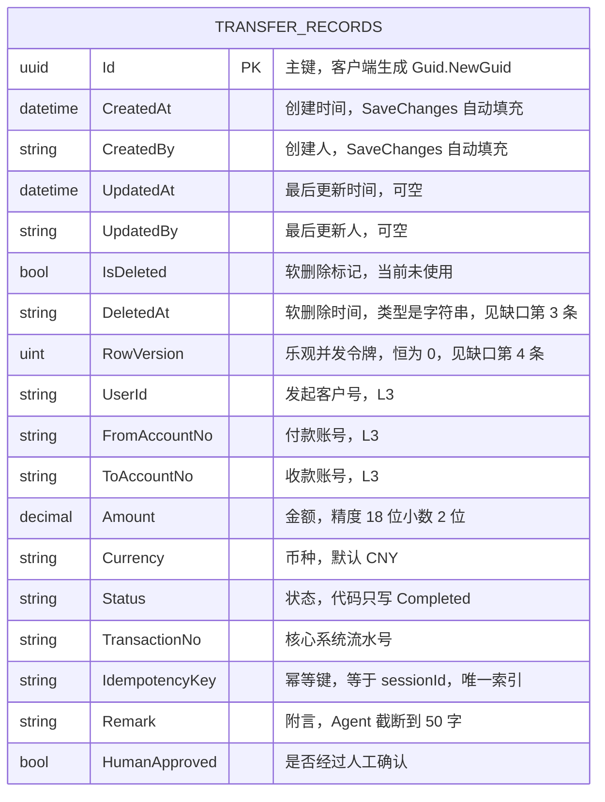
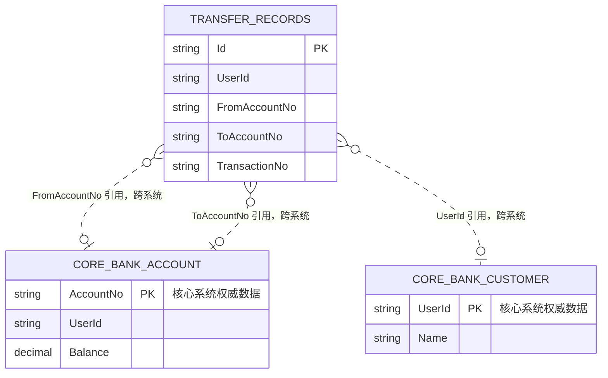
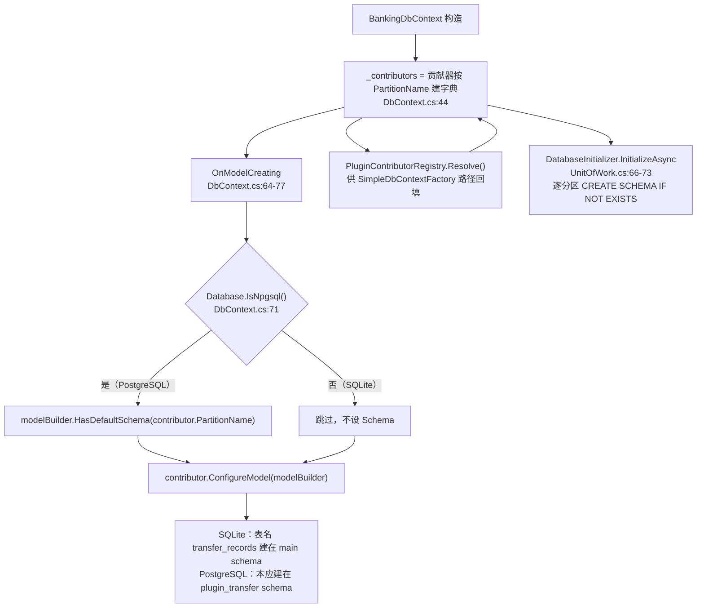
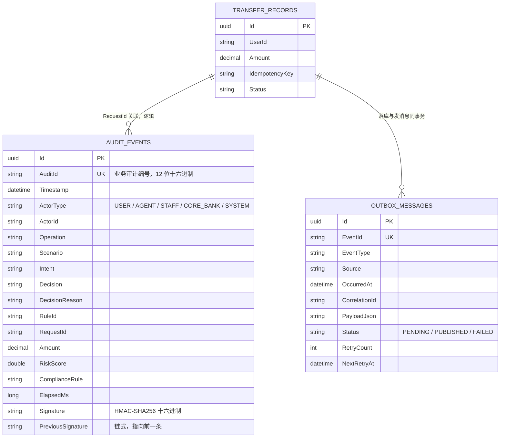

# 数据模型文档 — AI Banking Agent

> **范围**：插件可持久化的数据模型（`BankingDbContext` + 各插件的 `IEntitySetContributor`）。
> **重要事实**：当前系统**只有一张业务表** —— `transfer_records`。
> 另外两个插件（账单分析、卡片管理）不落库。本文如实反映这一现状，不虚构表结构；
> 规划中的表单独列出并明确标注 `【规划】`。
> **最后核对**：2026-09-27

---

## 目录

| 章节 | 内容 |
|------|------|
| [1](#1-er-图) | ER 图（实际） |
| [2](#2-表字段明细) | 表字段明细（19 个字段） |
| [3](#3-索引设计与理由) | 索引设计与理由 |
| [4](#4-审计字段规范) | 审计字段规范 |
| [5](#5-插件分区策略) | 插件分区策略（Schema 隔离 vs SQLite 降级） |
| [6](#6-迁移策略) | 迁移策略（EnsureCreated vs EF Migration） |
| [7](#7-数据保留期与合规对照) | 数据保留期与合规对照 |
| [8](#8-规划中的表规划) | 规划中的表 `【规划】` |
| [9](#9-已知缺口与改进项) | 已知缺口与改进项 |

---

## 1. ER 图

### 1.1 实际 ER 图



**图解**

- **表名 `transfer_records`** 由 `entity.ToTable("transfer_records")` 指定（`TransferPlugin.cs:78`）
- **主键 `Id`** 是 `Guid`，由 `BaseEntity` 的字段初始化器 `= Guid.NewGuid()` 在**客户端**生成，
  并用 `ValueGeneratedNever()` 显式关闭 EF 的值生成（`TransferPlugin.cs:80`）。
  理由：转账是资金操作，主键必须在发请求前就确定（可写入幂等键、可在审计里提前引用）。
- **没有外键**。表里只有 `UserId` / `FromAccountNo` / `ToAccountNo` 三个**逻辑引用**，
  指向的数据在核心系统（MockBank 内存 / 真实 CBS），**不在本库**。
  这是有意的：插件分区不能跨库建外键，核心系统的数据权威在它自己那边。

### 1.2 与外部系统的逻辑关系（非数据库外键）



**图解**

`CORE_BANK_ACCOUNT` / `CORE_BANK_CUSTOMER` **不存在于本数据库**。
它们是逻辑实体，数据权威在核心系统（开发期是 MockBank 的内存存储 `MockBankStore`）。
图中用 `}o..o|`（非识别关系）表示"逻辑引用但无数据库约束"。

**由此产生的一致性责任**：

| 责任 | 现状 |
|------|------|
| 引用完整性 | ❌ 无 FK 约束，账号可能被销户而记录仍存在 |
| 数据冗余 | ⚠️ 金额/账号在 `transfer_records` 与核心系统**双写**，核心系统是权威 |
| 删除同步 | 核心系统删账户，本库的转账历史**必须保留**（合规要求，见 [§7](#7-数据保留期与合规对照)） |
| 时钟一致性 | `TransferRecord.CreatedAt` 用宿主时钟（`DateTimeOffsetProvider.UtcNow`），核心系统用自己时钟；**两者可能不一致**，对账需以核心系统为准 |

---

## 2. 表字段明细

### 2.1 `transfer_records` — 继承自 `BaseEntity` 的 8 个字段

`BaseEntity`（`BaseEntity.cs:9-21`）：

| # | 字段 | C# 类型 | 数据库类型（SQLite） | 数据库类型（PostgreSQL） | 必填 | 约束 | 脱敏级别 | 说明 |
|---|------|---------|----------------------|-------------------------|:----:|------|:--------:|------|
| 1 | `Id` | `Guid` | `TEXT` | `uuid` | ✅ | **PK**，`ValueGeneratedNever()`，客户端生成 | L2 | 实体唯一标识 |
| 2 | `CreatedAt` | `DateTimeOffset` | `TEXT` | `timestamptz` | ✅ | 默认 `DateTimeOffset.UtcNow`，`SaveChanges` 强制覆盖 | L2 | 创建时间（UTC） |
| 3 | `CreatedBy` | `string?` | `TEXT` | `text` | ❌ 可空 | `SaveChanges` 填充；`Modified` 时**强制 `IsModified = false`** | L3 | 操作者 ID，来自令牌。⚠️ 审计文件里存的是哈希值（`HashActor`），库里存明文 |
| 4 | `UpdatedAt` | `DateTimeOffset?` | `TEXT` | `timestamptz` | ❌ 可空 | 仅 `Modified` 时填充 | L2 | 最后更新时间 |
| 5 | `UpdatedBy` | `string?` | `TEXT` | `text` | ❌ 可空 | 仅 `Modified` 时填充 | L3 | 最后操作者 |
| 6 | `IsDeleted` | `bool` | `INTEGER` | `boolean` | ✅ | 默认 `false`。**当前无任何代码把它设为 true** | — | 软删除标记（见缺口第 2 条） |
| 7 | `DeletedAt` | `string?` | `TEXT` | `text` | ❌ 可空 | ⚠️ **类型是 `string` 而非 `DateTimeOffset`**，与其他时间字段不一致 | — | 软删除时间（见缺口第 3 条） |
| 8 | `RowVersion` | `uint` | `INTEGER` | `integer` | ✅ | `IsConcurrencyToken()`，**但无值生成器** | — | 乐观并发令牌，**恒为 0**（见缺口第 4 条） |

### 2.2 `transfer_records` — `TransferRecord` 自己的 10 个字段

`TransferRecord`（`TransferPlugin.cs:53-65`）：

| # | 字段 | C# 类型 | 数据库类型 | 必填 | 约束 | 脱敏级别 | 说明 |
|---|------|---------|-----------|:----:|------|:--------:|------|
| 9 | `UserId` | `string` | `TEXT` | ✅ `required` | 索引 `(UserId, CreatedAt)` 的首列 | **L3** | 发起客户号。**取自 JWT 令牌，不信任请求体**（`Program.cs:398`） |
| 10 | `FromAccountNo` | `string` | `TEXT` | ✅ `required` | 无约束 | **L3** | 付款账号。未指定时取用户第一个「正常」账户（`TransferAgent.cs:81-87`） |
| 11 | `ToAccountNo` | `string` | `TEXT` | ✅ `required` | 无约束。**可与 `FromAccountNo` 相同**（合规模块会拦截，见下） | **L3** | 收款账号。由正则 `(?<account>\d{12,19})` 抽取（`TransferPlugin.cs:113`） |
| 12 | `Amount` | `decimal` | `TEXT`※ | ✅ | **`HasPrecision(18, 2)`**（`TransferPlugin.cs:81`）。业务约束 `> 0` 由合规模块保证 | **L3** | 金额（元）。※ SQLite 下 EF 默认把 `decimal` 存为 `TEXT`；PostgreSQL 下为 `numeric(18,2)` |
| 13 | `Currency` | `string` | `TEXT` | ✅（有默认值） | 默认 `"CNY"`。**无枚举约束**，可写入任意字符串 | L2 | 币种 |
| 14 | `Status` | `string` | `TEXT` | ✅（有默认值） | 默认 `"Pending"`，**代码只写 `"Completed"`**。无枚举约束 | L2 | 状态。⚠️ 中间态从不落库（见 [01-uml-diagrams.md §10.1](01-uml-diagrams.md#101-状态与代码的对应关系区分设计态与持久化态)） |
| 15 | `TransactionNo` | `string?` | `TEXT` | ❌ 可空 | **无唯一索引**（见 [§3](#3-索引设计与理由) 缺口） | L2 | 核心系统流水号，如 `TX202609270000084` |
| 16 | `IdempotencyKey` | `string?` | `TEXT` | ❌ 可空 | **唯一索引 `IsUnique()`**（`TransferPlugin.cs:83`） | L3 | 幂等键，值等于 `sessionId`（`TransferAgent.cs:141`） |
| 17 | `Remark` | `string?` | `TEXT` | ❌ 可空 | Agent 侧截断到 50 字（`TransferAgent.cs:173`）。**DB 侧无长度约束** | **L3** | 附言。⚠️ 内容是用户输入的原始自然语言，**可能含敏感信息** |
| 18 | `HumanApproved` | `bool` | `INTEGER` | ✅ | 默认 `false`。值 = `compliance.RequiresHumanApproval`（`TransferAgent.cs:205`） | L2 | 是否经过人工确认。⚠️ **不记录是谁确认的**（该信息在审计日志里） |

> **字段数核对**：`BaseEntity` 9 个字段（`Id` / `CreatedAt` / `CreatedBy` / `UpdatedAt` / `UpdatedBy` / `IsDeleted` / `DeletedAt` / `RowVersion` —— 实为 8 个）+
> `TransferRecord` 10 个 = **18 个持久化列**。
> 上表按 18 行编号（1~18），其中 1~8 来自基类，9~18 来自子类。

### 2.3 字段级业务约束（数据库外，由代码保证）

| 约束 | 强制位置 | 违反时的行为 |
|------|----------|--------------|
| `Amount > 0` | `TransferAmountRule.Evaluate`（`ComplianceRules.cs:33-36`） | `Deny` → `COMPLIANCE_REJECTED` |
| `Amount <= 500000`（硬上限） | `TransferAmountRule.Evaluate`（`ComplianceRules.cs:38-43`） | `Deny` → `COMPLIANCE_REJECTED` |
| `FromAccountNo != ToAccountNo` | `SelfTransferRule.Evaluate`（`ComplianceRules.cs:71-73`） | `Deny` → `COMPLIANCE_REJECTED` |
| `FromAccountNo` 与 `ToAccountNo` 非空 | `SelfTransferRule.Evaluate`（`ComplianceRules.cs:66-69`） | `Deny` → `COMPLIANCE_REJECTED` |
| 场景必须属于 `{transfer, wealth, card}` 才允许 `Amount > 0` | `ScenarioPermissionRule.Evaluate`（`ComplianceRules.cs:108-115`） | `Deny` → `COMPLIANCE_REJECTED` |
| `Status = "Completed"` 时 `TransactionNo` 必非空 | 隐含（`TransferAgent.cs:203` 同处赋值） | 无强制 |

> ⚠️ **所有阈值都是可配置的**（`Host/appsettings.json:31-37`），
> 改配置会改变上面几条约束的判定，**但不会改变表的结构**。
> 合规规则版本号（`RuleVersion`，如 `v1.5`）用于追溯"这条记录是按哪个版本规则判定的"，
> 但**规则版本没有落到数据表里**——只有审计日志的 `ComplianceRule` 字段记了它
> （`TransferAgent.cs:116`）。

### 2.4 脱敏级别总览

分级定义见 [`../05-security-compliance/03-data-classification.md`](../05-security-compliance/03-data-classification.md)，
实现见 `DataMasker`（`DataMasker.cs:11-120`）。

| 级别 | 定义 | 本表的字段 |
|:----:|------|-----------|
| **L1** 公开 | 可对外披露 | （无） |
| **L2** 内部 | 限团队内部 | `Id`、`CreatedAt`、`UpdatedAt`、`Currency`、`Status`、`TransactionNo` |
| **L3** 机密 | 需严格访问控制 | `CreatedBy`、`UpdatedBy`、`UserId`、`FromAccountNo`、`ToAccountNo`、`Amount`、`IdempotencyKey`、`Remark` |
| **L4** 绝密 | 加密存储 + 审批访问 | （无）—— 本表**没有 L4 字段** |

> **L4 字段（密码、CVV、密钥）被刻意排除在插件数据模型之外**。
> 这是正确的：CVV 依据支付行业规则**禁止存储**，CVV2 永久不得留存。
> 若未来引入 L4 字段，必须同步做加密（EF Core 的 `ValueConverter` + 应用层加解密），
> **仅靠 `DataMasker` 的输出脱敏是不够的**（它只防展示，不防落盘）。

---

## 3. 索引设计与理由

### 3.1 实际索引

| # | 索引 | 列 | 类型 | 定义位置 | 服务的查询 |
|---|------|-----|------|----------|-----------|
| 1 | **PK** | `Id` | 主键 | `TransferPlugin.cs:79` | 按主键查 |
| 2 | **IX_IdempotencyKey** | `IdempotencyKey` | **唯一** | `TransferPlugin.cs:83` | 转账幂等检查（`TransferAgent.cs:144`） |
| 3 | **IX_UserId_CreatedAt** | `(UserId, CreatedAt)` | 复合（非唯一） | `TransferPlugin.cs:84` | 用户转账历史（按时间倒序） |

### 3.2 每条索引的必要性论证

**索引 2（`IdempotencyKey` 唯一）— 必须有，且必须是唯一**

这是**资金安全的最后一道防线**。没有它，并发下两条相同键的记录都能插入，
重复扣款会被静默接受。有了它，至少 DB 层会拒绝第二次插入。

但要清楚它的**局限**（已在 [ADR-021](02-architecture-decision-record.md#adr-021) 详述）：

```
① SELECT ... WHERE IdempotencyKey = @key     ← 命中则直接返回原结果
② POST /transfers 到核心系统                  ← 真正扣款
③ INSERT TransferRecord                       ← 唯一索引在这里才生效
```

唯一索引拦不住"①②③ 并发执行"的情况——两次扣款在 ③ 之前就已发生。
**正确的做法是把 ① 和 ③ 合并为"带冲突处理的插入"**（见 [§6.3](#63-生产化切换路线) 的 outbox 方案）。

⚠️ **可空唯一索引的语义**：PostgreSQL 与 SQLite 都认为**多个 `NULL` 不冲突**（SQL 标准）。
所以 `IdempotencyKey` 可空时，`NULL` 之间不会触发唯一约束。
当前代码保证了非空（`TransferAgent.cs:141` 的随机 GUID 兜底），但**数据库层面没有 `NOT NULL` 约束**。

**索引 3（`(UserId, CreatedAt)`）— 复合索引顺序正确**

先 `UserId` 后 `CreatedAt`，因为查询模式是"某用户的转账，按时间倒序"。
这个顺序让索引既能过滤 `UserId`（等值）又能利用 `CreatedAt` 的有序性（范围/排序），
**避免额外的排序步骤**。如果写成 `(CreatedAt, UserId)`，则时间范围查询无法用上前导列。

⚠️ **当前没有查询端点消费这个索引**：`/api/chat` 不返回转账历史，
`/api/plugins` 只读内存中的 `PluginLoadResult`。
这个索引是**为将来准备的**（未来会加"我的转账记录"端点）。

### 3.3 索引缺口

| # | 缺口 | 影响 | 建议 |
|---|------|------|------|
| 1 | `TransactionNo` **无唯一索引** | 理论上可插入两条相同 `TransactionNo` 的记录 | 改为唯一索引（核心系统流水号天然唯一） |
| 2 | `Status` 无索引 | 按状态查（如"所有待确认"）会全表扫描 | ⚠️ 当前无此查询。**若实施持久化状态机（[ADR-021](02-architecture-decision-record.md#adr-021) 改造方向第 3 步），必须加** |
| 3 | `CreatedAt` 无独立索引 | 按时间范围查全量（如监管报送）会全表扫描 | 加 `IX_CreatedAt` |
| 4 | `IdempotencyKey` 无长度/格式约束 | 可写入超长值，浪费索引空间 | 加 `HasMaxLength(128)` |
| 5 | `Remark` 无长度约束 | 可写入超长文本 | 加 `HasMaxLength(256)`（Agent 侧已截断到 50，但 DB 侧无兜底） |
| 6 | 无任何**脱敏列加密** | L3 字段明文落盘 | 依据 [§7](#7-数据保留期与合规对照) 评估是否需要列级加密 |

---

## 4. 审计字段规范

### 4.1 五个审计字段的契约

| 字段 | 语义 | 谁写 | 何时写 | 谁能改 |
|------|------|------|--------|--------|
| `CreatedAt` | 实体创建时刻（UTC） | `BankingDbContext.ApplyAuditFields` | `EntityState.Added` | ❌ **任何人都改不了**（`IsModified = false`） |
| `CreatedBy` | 创建者 ID | 同上 | `Added` | ❌ 同上 |
| `UpdatedAt` | 最后修改时刻 | 同上 | `Modified` | 业务代码可改 |
| `UpdatedBy` | 最后修改者 | 同上 | `Modified` | 业务代码可改 |
| `IsDeleted` | 软删除标记 | **当前无代码写入** | — | — |

### 4.2 自动填充的实现

```csharp
// BankingDbContext.cs:95-118
private void ApplyAuditFields()
{
    var now = _clock.UtcNow;
    var user = _currentUser.UserId ?? "system";

    foreach (var entry in ChangeTracker.Entries<BaseEntity>())
    {
        switch (entry.State)
        {
            case EntityState.Added:
                entry.Entity.CreatedAt = now;
                entry.Entity.CreatedBy = user;
                break;
            case EntityState.Modified:
                entry.Entity.UpdatedAt = now;
                entry.Entity.UpdatedBy = user;
                // 防止审计字段被篡改：强制覆盖
                entry.Property(nameof(BaseEntity.CreatedAt)).IsModified = false;
                entry.Property(nameof(BaseEntity.CreatedBy)).IsModified = false;
                break;
        }
    }
}
```

调用点：`SaveChanges(bool)`（`:80-84`）与 `SaveChangesAsync(bool, ct)`（`:87-92`），
两个重载都在调用 `base` 之前先执行 `ApplyAuditFields()`。
`SaveChangesAsync(ct)` 重载转发到 `SaveChangesAsync(true, ct)`（`:121-122`），**不会绕过**。

**三个设计要点**：

1. **`_clock` 是注入的 `DateTimeOffsetProvider`**（`DbContext.cs:42`），
   支持 `factory` 参数做确定性重放与时间旅行测试（`DbContext.cs:164-170`）。
   最小构造路径用 `DateTimeOffsetProvider.Static`。
2. **`_currentUser` 来自 `CurrentUserAccessor`，基于 `AsyncLocal`**（`DbContext.cs:215`）。
   鉴权中间件在每个请求开始时 `Enter(userId, role)`（`Program.cs:97`），
   请求结束时 `Dispose` 还原（`CurrentUserAccessor.cs:224`）。
   若中间件未执行（如后台任务），`UserId` 为 `null` → 落库为 `"system"`（`DbContext.cs:98`）。
3. **`IsModified = false` 是安全关键**（`DbContext.cs:112-114`）：
   防止业务代码在更新实体时顺手改掉创建信息。

### 4.3 审计的"双轨"设计

本系统有**两套彼此独立的审计**，职责不同，**不要混淆**：

| 维度 | 实体审计字段（DB） | 审计日志链（文件） |
|------|--------------------|--------------------|
| 载体 | 表的 5 个列 | `logs/audit-chain.log`（JSON Lines） |
| 写入者 | `BankingDbContext.ApplyAuditFields` | `AuditLogger.WriteAsync` |
| 触发时机 | 每次 `SaveChanges` | **每次 Agent 执行**、每次合规决策、每次人工确认 |
| 内容 | 谁在什么时候改了这个实体 | 决策链路：意图、规则 ID、风险分、金额、结论 |
| 防篡改 | ❌ 有 UPDATE 权限就能改 | ✅ HMAC-SHA256 链式签名，任何篡改都会导致链断裂 |
| 保留期 | 与业务数据同生命周期 | 应独立保留（见 [§7.3](#73-审计日志的保留期)） |
| 离线可验 | ❌ 需连库 | ✅ 纯文本文件，拷出来就能校验 |

**`AuditLogger.VerifyChain` 的用法**（`AuditLogger.cs:134-157`）：

```csharp
var events = ReadAuditFile();                  // 逐行反序列化为 AuditEvent
var result = auditLogger.VerifyChain(events);
if (!result.IsValid)
    Alert($"审计链在第 {string.Join(",", result.BrokenIndexes)} 条断裂");
```

⚠️ **跨进程重启会误报**：`_lastSignature` 只在内存（`AuditLogger.cs:73`），
重启后新记录从 `GENESIS` 开始（`AuditLogger.cs:104`、`PreviousSignature = null`），
而文件是追加不清空的。因此校验时**必须按"链段"切分**：
`PreviousSignature == null` 的记录即一个新链段的起点。
当前 `VerifyChain` **没有实现这个逻辑**（`AuditLogger.cs:137` 期望首条 `expectedPrev = null`），
所以直接对整个文件调用会报"第 N 条断链"。

### 4.4 审计字段与 `ISensitiveEntity` 的脱钩

`BaseEntity.cs:24-29` 定义了 `ISensitiveEntity`：

```csharp
public interface ISensitiveEntity
{
    DataClassification MaxClassification { get; }
    IReadOnlyCollection<string> MaskedFields { get; }
}
```

**⚠️ 没有任何实体实现它**（`TransferRecord`、`BaseEntity` 都没实现）。
本项目实际靠的是 `BankingDbContext.Snapshot` 的**字段名启发式脱敏**：

```csharp
// BankingDbContext.cs:136-156
private static Dictionary<string, object?> Snapshot(BaseEntity entity)
{
    foreach (var prop in entity.GetType().GetProperties())
    {
        if (prop.Name is nameof(BaseEntity.RowVersion)) continue;
        var value = prop.GetValue(entity);
        dict[prop.Name] = value switch
        {
            string s when prop.Name.Contains("Pwd") || prop.Name.Contains("Password")
                          || prop.Name.Contains("Cvv") || prop.Name.Contains("Secret")
                => "********",
            string s2 when prop.Name.Contains("Phone") => DataMasker.MaskPhone(s2),
            string s3 when prop.Name.Contains("IdCard") => DataMasker.MaskIdCard(s3),
            _ => value
        };
    }
}
```

| 方法 | 特性 | 局限 |
|------|------|------|
| 字段名启发式 | 零配置，新增实体自动生效 | ⚠️ **基于英文字段名**。`FromAccountNo` / `ToAccountNo` / `Amount` / `UserId` 都**匹配不到任何规则**，会以明文进入快照 |
| `ISensitiveEntity` 显式声明 | 精确、可表达 L4 | ❌ 未实现 |
| 实体自实现 `ISensitiveEntity` 后由 `Snapshot` 读取 | 两全 | 待实施 |

---

## 5. 插件分区策略

### 5.1 机制：`IEntitySetContributor`

```csharp
// BankingDbContext.cs:18-26
public interface IEntitySetContributor
{
    string PartitionName { get; }                                    // 分区名（子 Schema / 表前缀）
    void ConfigureModel(ModelBuilder modelBuilder);                  // 注册实体映射
    DataClassification MaxClassification { get; }                    // 该分区最高敏感级别
}
```

**三个插件的实现情况**：

| 插件 | 是否实现 | `PartitionName` | `MaxClassification` | 注册的实体 |
|------|:--------:|-----------------|--------------------|-----------|
| `banking.transfer` | ✅ `TransferPersistenceContributor`（`TransferPlugin.cs:68`） | `"plugin_transfer"` | `L3`（`TransferPlugin.cs:72`） | `TransferRecord` |
| `banking.bill` | ❌ | — | — | 无（只读核心系统） |
| `banking.card` | ❌ | — | — | 无（直接调核心系统） |

注册位置：`services.AddSingleton<IEntitySetContributor, TransferPersistenceContributor>()`
（`TransferPlugin.cs:43`）。

### 5.2 分区模型如何进入 EF



**图解**

### 5.3 PostgreSQL 下的目标形态（Schema 隔离）

```sql
-- DatabaseInitializer.InitializeAsync 自动创建（UnitOfWork.cs:68-73）
CREATE SCHEMA IF NOT EXISTS "plugin_transfer";

-- TransferPersistenceContributor.ConfigureModel 生成
CREATE TABLE "plugin_transfer"."transfer_records" (
    "Id"            uuid  NOT NULL,
    "CreatedAt"     text  NOT NULL,
    ...
    "Amount"        numeric(18,2) NOT NULL,
    "RowVersion"    integer NOT NULL,
    CONSTRAINT "PK_transfer_records" PRIMARY KEY ("Id")
);
CREATE UNIQUE INDEX "IX_transfer_records_IdempotencyKey"
    ON "plugin_transfer"."transfer_records" ("IdempotencyKey");
CREATE INDEX "IX_transfer_records_UserId_CreatedAt"
    ON "plugin_transfer"."transfer_records" ("UserId", "CreatedAt");
```

**Schema 隔离带来的三个好处**：

1. **命名空间隔离**：不同插件的同名表不会冲突，插件可以自由命名表。
2. **权限隔离**：可以按 Schema 授权——`transfer` 分区的写权限只给转账插件。
   配合 PostgreSQL 的 Row-Level Security 可实现"插件只能写自己的分区"。
3. **运维隔离**：单分区的表可以独立备份/归档/迁移（分区表裁剪）。

### 5.4 SQLite 降级

SQLite **不支持真正的 Schema**（`ATTACH DATABASE` 只能附加整个数据库文件）。
`OnModelCreating` 用 `if (Database.IsNpgsql())` 判断（`DbContext.cs:71`），
非 PostgreSQL 时**跳过 `HasDefaultSchema`**，所有表都建在 `main` schema。

⚠️ **注意**：`DatabaseInitializer.InitializeAsync` 里**只对 Npgsql 建 Schema**（`UnitOfWork.cs:66-73`），
非 Npgsql 直接 `EnsureCreatedAsync`（`UnitOfWork.cs:75`）。

**降级后的隔离手段（当前）**：

| 手段 | 状态 |
|------|------|
| 表名前缀 | ❌ 未采用（表名是 `transfer_records`，无 `plugin_transfer_` 前缀） |
| 分区字典约束 | ⚠️ `Partitions` 属性存在（`DbContext.cs:61`），但**没有任何代码阻止插件 A 写插件 B 的表** |
| 权限隔离 | ❌ SQLite 无 Schema 权限 |

**结论：SQLite 环境下分区隔离只是"命名约定"，不是强制约束。**
真实的多插件环境（尤其引入第三方插件）**必须用 PostgreSQL**。

### 5.5 ⚠️ 关键缺陷：多 Schema 隔离当前**不生效**

```csharp
// BankingDbContext.cs:64-77 —— 这是当前实现
protected override void OnModelCreating(ModelBuilder modelBuilder)
{
    base.OnModelCreating(modelBuilder);
    foreach (var contributor in _contributors.Values)
    {
        // SQLite 不支持真正的 Schema，PostgreSQL 下映射为独立 Schema。
        if (Database.IsNpgsql())
        {
            modelBuilder.HasDefaultSchema(contributor.PartitionName);   // ← 循环内反复设置
        }
        contributor.ConfigureModel(modelBuilder);
    }
}
```

**问题**：`HasDefaultSchema` 是**全局设置**，不是按实体设置。
在循环里调用 N 次，**最后一次生效**。
当前只有一个贡献器（`plugin_transfer`），所以看不出问题；
一旦有第二个插件（比如 `plugin_wealth`），两者的表**都会建到 `plugin_wealth` schema**。

**正确写法**（`【规划】`，本次未改代码）：

```csharp
// 方案 A：显式指定 schema（EF Core 5+）
contributor.ConfigureModel(modelBuilder);
// 贡献器内部改为：
//   entity.ToTable("transfer_records", "plugin_transfer");
//
// 方案 B：设置默认 schema 后立即交还
// 不推荐，多贡献者时仍需每个贡献器显式指定
```

即：**`ToTable(name, schema)` 是唯一正确的多 Schema 方案**，`HasDefaultSchema` 只能用作"未指定时的默认值"。
`TransferPersistenceContributor.ConfigureModel` 目前只写了 `ToTable("transfer_records")`（`TransferPlugin.cs:78`），
**没有传 schema**。

另外，`DatabaseInitializer` 循环创建的 `CREATE SCHEMA` 语句用了插值拼接
（`UnitOfWork.cs:71`：``$"CREATE SCHEMA IF NOT EXISTS \"{partition}\";"``）。
当前 `partition` 来自硬编码常量（`"plugin_transfer"`），**没有注入风险**；
但若将来允许插件自定义分区名，这里需要加标识符合法性校验。

### 5.6 两套分区名的差异（易踩坑）

| 来源 | 取值 | 用途 |
|------|------|------|
| `IPluginContext.PartitionName`（`PluginRegistry.cs:328`） | `banking_transfer` | **日志标识**：`logger.CreateLogger("Plugin:" + Manifest.Id.Value)`（`PluginRegistry.cs:330`） |
| `IEntitySetContributor.PartitionName`（`TransferPlugin.cs:70`） | `plugin_transfer` | **真正的 Schema 名** |

`PluginLifecycleBridge.SimplePluginContext.PartitionName` 同样用推导逻辑（`Program.cs:598`），
所以启动钩子侧看到的也是 `banking_transfer`。

**排查数据库问题时必须记住这两个名字不一样。**

---

## 6. 迁移策略

### 6.1 当前实现：`EnsureCreatedAsync`

```csharp
// UnitOfWork.cs:56-85
public async Task InitializeAsync(CancellationToken ct = default)
{
    if (!autoMigrate) { logger.LogInformation("跳过自动建表（AutoMigrate=false），请手动执行迁移"); return; }
    try
    {
        if (db.Database.IsNpgsql())
            foreach (var partition in db.Partitions)
                await db.Database.ExecuteSqlRawAsync($"CREATE SCHEMA IF NOT EXISTS \"{partition}\";", ct);

        await db.Database.EnsureCreatedAsync(ct);
        logger.LogInformation("数据库初始化完成。Provider={Provider}, 分区数={Count}, 分区=[{Partitions}]", ...);
    }
    catch (Exception ex) { logger.LogError(ex, "数据库初始化失败"); throw; }
}
```

调用点：`Program.cs:68-72`，在 `builder.Build()` 之后、插件启动之前。
开关：`Database:AutoMigrate`（`Host/appsettings.json:13`，默认 `true`）。

### 6.2 为什么当前用 `EnsureCreated` 而不是 EF Migration

| 理由 | 说明 |
|------|------|
| **模型是插件动态决定的** | 实体映射来自运行时加载的 `IEntitySetContributor`（[ADR-012](02-architecture-decision-record.md#adr-012)）。<br>迁移脚本必须在**编译期**由 `dotnet ef migrations add` 从固定 DbContext 生成，<br>而这里 DbContext 的模型随插件目录内容变化 |
| **演示/开发环境优先零配置** | `EnsureCreated` 首次运行自动建表，无需 `dotnet ef` 工具链。<br>对 5 人团队的课程项目/演示这是最优选择 |
| **数据是易失的** | SQLite 单文件 + 演示数据，重建成本接近 0 |
| **避免引入设计时工厂** | EF Migration 需要一个 `IDesignTimeDbContextFactory`，<br>而 `BankingDbContext` 的构造需要 DI 提供贡献器与当前用户（`DbContext.cs:38-47`），<br>设计时工厂要再写一遍装配逻辑（虽然 `SimpleDbContextFactory` 可以复用） |
| **`EnsureCreated` 不会改已有表** | 它只在**数据库为空**时建表；库已存在则**完全不动**。<br>这比"半成品的自动迁移"更安全——不会静默改坏生产数据 |

**最后一条是 `EnsureCreated` 在这里唯一真正安全的原因，必须理解**：
它的行为是"空库则建，非空库则什么都不做"，**不是**"把库改成模型的样子"。

### 6.3 生产化切换路线

| 阶段 | 动作 | 具体做法 | 风险 |
|:----:|------|----------|------|
| **0** | 冻结模型 | 停止新增/修改实体；确认 `EnsureCreated` 产出的结构就是基线 | 无 |
| **1** | 引入设计时工厂 | 实现 `IDesignTimeDbContextFactory<BankingDbContext>`，复用 `SimpleDbContextFactory` + 一个固定贡献器列表 | 无（纯新增） |
| **2** | 生成基线迁移 | `dotnet ef migrations add Baseline --project BankingAgent.Base`<br>生成的 SQL 需人工审阅（尤其 PostgreSQL 的 `numeric(18,2)`、索引、Schema） | 需审阅 |
| **3** | 关掉 `AutoMigrate` | `Database:AutoMigrate = false`（`UnitOfWork.cs:58-62` 已支持） | 无 |
| **4** | 引入迁移执行器 | 启动时（或部署流水线）执行 `db.Database.MigrateAsync()`。<br>**推荐用部署流水线而非启动时**：多实例同时迁移会冲突 | 中 |
| **5** | 处理插件模型变更 | 见下方"插件表迁移的特殊问题" | 🔴 高 |
| **6** | 生产用 PostgreSQL | 补装 `Npgsql.EntityFrameworkCore.PostgreSQL`（`DIExtensions.cs:83-85` 已给出明确报错指引） | 中 |

**`Database:Provider = Npgsql` 的当前行为**：
代码会**明确抛异常**而不是给出晦涩的类型错误：

```csharp
// BankingCoreServiceCollectionExtensions.cs:83-87
throw new InvalidOperationException(
    "检测到 Database:Provider=Npgsql，但未安装 Npgsql provider。" +
    "请执行: dotnet add BankingAgent.Base package Npgsql.EntityFrameworkCore.PostgreSQL");
```

⚠️ **这是一个刻意的"未实现"声明**：PostgreSQL provider **未安装**，
代码路径只是为将来预留。当前**只能用 SQLite**。

### 6.4 插件表迁移的特殊问题（最难的一点）

标准 EF Migration 假设"模型在编译期确定"。但本项目的模型是**运行时**由插件决定的：

| 场景 | 标准 EF 的表现 | 本项目的表现 |
|------|---------------|-------------|
| 新增插件（带来新表） | 迁移文件里没有该表 | `EnsureCreated` **不会建**（库非空） |
| 升级插件（表加列） | 迁移里有 `AddColumn` | 同样不会执行 |
| 删除插件 | 迁移里有 `DropTable` | 迁移文件被硬编码，不会跟随 |

**三条应对路线**：

| 路线 | 做法 | 适用 |
|------|------|------|
| **A. 插件自带迁移**（推荐） | 插件在 `IPlugin` 的 `OnStartingAsync` 里调用 `db.Database.MigrateAsync()`，迁移放在插件自己的程序集 | 插件自治，宿主编译期无感知 |
| **B. 集中式迁移清单** | 宿主维护一个 `migrations.json`，列出每个插件每个版本的迁移脚本路径 | 可控可审计，但宿主要改 |
| **C. 保持 `EnsureCreated` + 手工 DDL** | 新增表时人工在库里建 | 演示环境可以，生产不可 |

⚠️ 路线 A 有一个**前置阻塞**：[ADR-021](02-architecture-decision-record.md#adr-021) 中记录的
"启动钩子永不触发"缺陷（`PluginLoadResult.IsActive` 默认 `true`，`PluginRegistry.cs:24` + `:209`），
会导致 `OnStartingAsync` 不执行。**必须先修这个缺陷，路线 A 才成立。**

### 6.5 Provider 差异对照

| 特性 | SQLite | PostgreSQL | 备注 |
|------|:------:|:----------:|------|
| Schema 隔离 | ❌ | ✅ | [§5.3](#53-postgresql-下的目标形态schema-隔离) |
| `decimal` 存储 | `TEXT` | `numeric(18,2)` | SQLite 存 TEXT 会导致**排序是字符串序**——对金额是危险的 |
| 并发写 | 全库锁 | MVCC | SQLite 下高并发转账会大量 `SQLITE_BUSY` |
| 事务隔离 | `Serializable`（实际） | 默认 `Read Committed` | |
| 部分索引 | ✅ | ✅ | |
| JSON 列 | 文本 | `jsonb` | `Extra` 字段如果落库应考虑 |
| 全文检索 | FTS5 | `tsvector` | 交易备注搜索 |
| **当前可用** | ✅ | ❌ **未装 provider** | `DIExtensions.cs:82-86` |

> 🔴 **`decimal` 存 TEXT 的风险**：`ORDER BY Amount` 在 SQLite 下会按字符串比较，
> `"900.00" > "1000.00"` 为真。**任何按金额排序的查询在 SQLite 下都是错的。**
> 这是从 SQLite 迁到 PostgreSQL 的**硬性理由**之一。

---

## 7. 数据保留期与合规对照

> ⚠️ **免责声明**：以下条款号与保留期为工程侧整理的**实现参考**，
> 用于指导技术方案选型，**不构成法律意见**。落地前必须由法务与合规部门确认，
> 并以监管机构的实际要求为准。

### 7.1 法规要求汇总

| 法规 | 相关条款 | 对数据模型的约束 |
|------|----------|------------------|
| **《反洗钱法》** | 第 16 条：客户身份资料和交易记录，保存期限自业务关系结束当年或交易记账当年计起**至少 5 年** | `transfer_records` **不可删除**，至少 5 年 |
| **《反洗钱法》** | 第 19 条：暂时不予保存的记录应当予以冻结，冻结期限另定 | 需支持"冻结"状态（**当前未实现**） |
| **《反洗钱法》** | 第 30 条：交易记录应保存**可供查验**的检索方式 | `TransactionNo` 应有索引与查询能力（**当前无查询端点**） |
| **《个人信息保护法》** | 第 19 条：保存期限应当为**实现处理目的所必要的最短时间** | 与反洗钱的 5 年要求**存在张力**，需在合规层做"到期后去标识化"而非删除 |
| **《个人信息保护法》** | 第 28 条：敏感个人信息（金融账户）是 L3/L4 | 需访问控制 + 加密 + 影响评估 |
| **《个人信息保护法》** | 第 47 条：删除义务与"法律要求保留"的情形 | 到期可删，但**反洗钱要求保留的除外** |
| **《商业银行法》** | 第 29 条：为存款人保密 | 跨用户的数据隔离（本系统靠令牌 userId 保证） |
| **《生成式人工智能服务管理暂行办法》** | 训练数据来源合法性、个人信息保护 | 若 LLM 上下文含个人信息，需脱敏（`DataMasker` 承担） |
| **《信息安全技术 个人信息安全规范》GB/T 35273** | 最小必要、去标识化 | 审计文件用 `HashActor` 哈希用户 ID 是正确实践 |

### 7.2 字段级保留期建议

| 字段 | 数据类别 | 建议保留期 | 依据 | 备注 |
|------|----------|-----------|------|------|
| `Id` | 内部标识 | 与记录同寿 | — | |
| `CreatedAt` | 时间戳 | **≥ 5 年** | 《反洗钱法》第 16 条 | |
| `CreatedBy` / `UpdatedBy` | **个人信息** | **≥ 5 年** | 《反洗钱法》第 16 条（操作记录） | ⚠️ 存储即个人信息的处理，需在隐私政策中告知 |
| `UserId` | **个人信息（金融账户关联）** | **≥ 5 年** | 《反洗钱法》第 16 条 | L3 |
| `FromAccountNo` / `ToAccountNo` | **敏感个人信息** | **≥ 5 年** | 《反洗钱法》第 16 条 | L3。⚠️ 个保法下应加密存储 |
| `Amount` | 交易金额 | **≥ 5 年** | 《反洗钱法》第 16 条 | L3 |
| `Currency` / `Status` | 业务字段 | ≥ 5 年 | — | L2 |
| `TransactionNo` | 交易凭证 | **≥ 5 年** | 《反洗钱法》第 30 条（可供查验） | ⚠️ 应有索引与查询能力 |
| `IdempotencyKey` | 技术字段 | **建议 7 天** | 技术需要，非业务需要 | L3。⚠️ 早于业务保留期到期，**但它含会话标识** |
| `Remark` | **用户自由文本** | ⚠️ **需专项评估** | 可能含身份证号、手机号等 | 🔴 **最高风险字段**，见 [§7.5](#75-remark-字段的合规风险) |
| `RowVersion` | 技术字段 | 与记录同寿 | — | |
| `IsDeleted` / `DeletedAt` | 技术字段 | 与记录同寿 | — | 当前未使用 |

### 7.3 审计日志的保留期

| 项 | 建议 | 说明 |
|----|------|------|
| `logs/audit-chain.log` | **≥ 5 年**，独立介质 | 《反洗钱法》第 16 条的"交易记录"包含操作记录 |
| 轮转策略 | 按月分文件 + 归档 | 当前是**单文件无限追加**（`AuditLogger.cs:213`），长期会撑爆磁盘 |
| 归档后校验 | 用 `VerifyChain` 逐段校验 | 需先实现"按 `PreviousSignature == null` 切分链段"（[§4.3](#43-审计的双轨设计)） |
| 存储介质 | 生产应为**只写一次（WORM）**存储 | 审计链防篡改只保护了**内容**，没保护**文件本身**。有文件系统权限的人可以整文件替换 |

### 7.4 当前实现的合规缺口

| # | 缺口 | 法规关联 | 优先级 |
|---|------|----------|:------:|
| 1 | **无数据保留期执行机制**。没有任何定时任务/后台作业清理或匿名化过期数据 | 个保法第 19 条（最短时间） | 🔴 高 |
| 2 | **无数据主体权利响应能力**。没有"查询/更正/删除/可携带"端点 | 个保法第 44~50 条 | 🔴 高 |
| 3 | **L3 字段明文存储**（账号、金额、UserId） | 个保法第 51 条（加密） | 🔴 高 |
| 4 | **`Remark` 无内容审查**。用户可写入任意文本 | 个保法 | 🔴 高 |
| 5 | **无"冻结"状态**（《反洗钱法》第 19 条的暂时不予保存） | 反洗钱法第 19 条 | 🟠 中 |
| 6 | **无反洗钱报送实现**。`AmlThresholdRule` 只打标，不外发 | 反洗钱法第 20 条 | 🟠 中 |
| 7 | **无交易记录查询端点**（《反洗钱法》第 30 条要求"可供查验"） | 反洗钱法第 30 条 | 🟠 中 |
| 8 | **审计文件单文件无限追加**，无轮转 | 反洗钱法第 16 条（可用性） | 🟠 中 |
| 9 | **审计文件非 WORM**，可被整文件替换 | 反洗钱法（防篡改） | 🟠 中 |
| 10 | **无数据访问日志**。谁查了 `transfer_records` 没有记录 | 个保法第 51 条 | 🟡 中 |
| 11 | **无跨境传输管控**。当前 LLM 未接入，接入后需评估 | 个保法第 38 条 | 🟢 低（当前不适用） |
| 12 | **无数据安全影响评估记录** | 个保法第 55 条 | 🟡 中 |

### 7.5 `Remark` 字段的合规风险（专项）

`Remark` 的值是**用户输入的原始自然语言前 50 字**：

```csharp
// TransferAgent.cs:173
Remark = request.UserInput.Length > 50 ? request.UserInput[..50] : request.UserInput
```

用户完全可能输入：
`"转给张三 身份证 110101199001011234 尾号8888"`，这 50 字里同时含 **L3 姓名 + L4 身份证**。

**当前无任何防护**：

| 缺失 | 位置 |
|------|------|
| 无输入内容审查 | `TransferAgent.HandleAsync` 全文 |
| 无 L4 数据过滤 | 同上 |
| 无长度/格式约束 | `TransferPlugin.cs` 的 `ConfigureModel` 未对 `Remark` 做 `HasMaxLength` |
| 落库时无脱敏 | `BankingDbContext.ApplyAuditFields` 不处理业务字段 |
| 展示时无脱敏 | 成功后不返回 `Remark`（✅ 这一点是安全的），但**数据库里明文可见** |

**建议的三层防护**：

1. **入库前**（`TransferAgent`）：正则扫描 `Remark`，命中身份证/手机号/卡号模式则**拒绝或脱敏**；
2. **入库时**（`ConfigureModel`）：`HasMaxLength(256)` + 字段级加密（EF `ValueConverter`）；
3. **展示时**：永不返回原文（当前已满足）。

---

## 8. 规划中的表 `【规划】`

以下表**当前不存在**，是按当前架构缺口推导的规划清单，供后续 ADR 参考。

### 8.1 规划 ER 图



**图解**

### 8.2 `audit_events` 规划表

**为什么需要**：当前审计只写文件（`logs/audit-chain.log`），**无法查询**。
《反洗钱法》第 30 条要求交易记录"可供查验"，纯文件无法支撑在线查询与统计。

| 字段 | 类型 | 脱敏 | 说明 | 对应 `AuditEvent` |
|------|------|:----:|------|------------------|
| `Id` | `Guid` | L2 | 主键 | 新增 |
| `AuditId` | `string` | L2 | 业务审计编号，**唯一索引**。当前取 `Guid[..12]`（`AgentBase.cs:41`） | `AuditEvent.AuditId` |
| `Timestamp` | `DateTimeOffset` | L2 | 事件时刻 | `AuditEvent.Timestamp` |
| `ActorType` | `string` | L2 | `USER` / `AGENT` / `STAFF` / `CORE_BANK` / `SYSTEM` | `AuditEvent.ActorType` |
| `ActorId` | `string` | **L3** | 操作者。**入库存明文，文件存哈希** | `AuditEvent.ActorId` |
| `Operation` | `string` | L2 | 如 `agent.execute`、`compliance.evaluate`、`human.approval` | `AuditEvent.Operation` |
| `Scenario` | `string` | L2 | `transfer` / `bill` / `card` | `AuditEvent.Scenario` |
| `Intent` | `string` | L2 | 意图标识 | `AuditEvent.Intent` |
| `Decision` | `string` | L2 | `ALLOW` / `DENY` / `REQUIRE_APPROVAL` / `APPROVED` / `SUCCESS` / `FAILED` / `EXCEPTION` | `AuditEvent.Decision` |
| `DecisionReason` | `string` | **L3** | 决策原因，可能是自然语言 | `AuditEvent.DecisionReason` |
| `RuleId` | `string` | L2 | 命中的规则 | `AuditEvent.RuleId` |
| `RequestId` | `string` | L2 | 请求追踪号 | `AuditEvent.RequestId` |
| `Amount` | `decimal?` | **L3** | 金额 | `AuditEvent.Amount` |
| `RiskScore` | `double?` | L2 | 风险分 0~1 | `AuditEvent.RiskScore` |
| `ComplianceRule` | `string` | L2 | 规则版本（如 `v1.5`） | `AuditEvent.ComplianceRule` |
| `ElapsedMs` | `long` | L2 | 耗时 | `AuditEvent.ElapsedMs` |
| `Signature` | `string` | L2 | HMAC 签名 | `AuditEvent.Signature` |
| `PreviousSignature` | `string?` | L2 | 链式 | `AuditEvent.PreviousSignature` |

**关键设计约束**：

| 约束 | 理由 |
|------|------|
| **只允许 INSERT，不提供 UPDATE/DELETE** | `AuditLogger` 的注释已声明（`AuditLogger.cs:4`）"应用层不提供更新/删除路径" |
| `Signature` / `PreviousSignature` 必须落库 | 否则 DB 里的记录无法离线验证链完整性 |
| 建议分区 | 按月分区（`Timestamp`），便于按期归档与删除 |
| 建议索引 | `(ActorId, Timestamp)` 查某人操作；`(Operation, Timestamp)` 统计；`(RuleId)` 查规则命中率 |
| ⚠️ 链跨重启 | 必须记录"链段"标识（见 [§4.3](#43-审计的双轨设计)），否则校验会误报 |

### 8.3 `outbox_messages` 规划表

**为什么需要**：[ADR-020](02-architecture-decision-record.md#adr-020) 指出，
当前 `TransferAgent` 先 `SaveChangesAsync`（`TransferAgent.cs:209`）再 `PublishAsync`（`:212`），
**进程崩溃会丢事件**。账单插件订阅 `transfer.completed` 来刷新视图（`BillPlugin.cs:120`），
丢事件意味着账单视图永久不一致。

**Outbox 模式**：

```
① BEGIN TX
② INSERT transfer_records
③ INSERT outbox_messages (PENDING)
④ COMMIT
⑤ 后台投递器轮询 outbox_messages → 发事件 → 标记 PUBLISHED
```

| 字段 | 类型 | 说明 |
|------|------|------|
| `Id` | `Guid` | 主键 |
| `EventId` | `string` | 事件 ID，**唯一索引**（`DomainEvent.EventId`） |
| `EventType` | `string` | 如 `transfer.completed` |
| `Source` | `string` | 发布方插件 ID |
| `OccurredAt` | `DateTimeOffset` | 发生时刻 |
| `CorrelationId` | `string?` | 关联 ID（`SessionId`） |
| `PayloadJson` | `string` | 载荷 JSON |
| `Status` | `string` | `PENDING` / `PUBLISHED` / `FAILED` |
| `RetryCount` | `int` | 重试次数 |
| `NextRetryAt` | `DateTimeOffset?` | 下次重试时刻（指数退避） |

**迁移到 Kafka 时**，这个表就是 Kafka 生产者的数据源，outbox 模式天然兼容。

### 8.4 规划中的分区

| 分区名 | 归属插件 | 规划实体 |
|--------|----------|----------|
| `plugin_transfer` | `banking.transfer` | `transfer_records`（**已实现**）、`transfer_outbox` |
| `plugin_bill` | `banking.bill` | `bill_snapshots`（账单缓存，避免每次调核心系统） |
| `plugin_card` | `banking.card` | `card_operation_records`（挂失/冻结历史） |
| `core_audit` | Base | `audit_events` |

---

## 9. 已知缺口与改进项

按优先级汇总（🔴 影响正确性或合规，🟠 影响可运维性，🟡 影响工程质量）：

| # | 缺口 | 位置 | 级别 | 建议 |
|---|------|------|:----:|------|
| 1 | **幂等键复用 `SessionId`**，同会话第二笔转账被误判为重复并返回错误的成功信息 | `TransferAgent.cs:141-163` | 🔴 | 改为 `SHA256(userId + sessionId + canonical(槽位))`，见 [ADR-021](02-architecture-decision-record.md#改造方向分三步建议按序推进) |
| 2 | **幂等"先查后写"无事务**，并发下可能重复扣款 | `TransferAgent.cs:144` / `:208` | 🔴 | 引入 outbox + `INSERT ON CONFLICT DO NOTHING` 抢占 |
| 3 | **`IdempotencyKey` 未发给核心系统**，缺第二道防线 | `CoreBankClient.cs:63-71` | 🔴 | 加入请求体，MockBank 侧实现同键去重 |
| 4 | **状态机不落库**。`Status` 只有 `Completed`，中间态全丢，崩溃后无法恢复 | `TransferPlugin.cs:60`、`TransferAgent.cs:202` | 🔴 | 落库全部中间态 + `IX_Status` 索引 |
| 5 | **`Remark` 无内容审查**，可能写入 L4 身份证号 | `TransferAgent.cs:173` | 🔴 | 入库前正则扫描 + 脱敏 |
| 6 | **多 Schema 隔离不生效**。`HasDefaultSchema` 在循环里被覆盖 | `BankingDbContext.cs:68-76` | 🔴 | 改用 `ToTable(name, schema)` |
| 7 | **`/api/plugins/events` 泄露全系统账号**（任何 user 角色可读 `payload` 明文账号） | `Program.cs:307-319` | 🔴 | 限制为 `CanAudit` 或按 `UserId` 过滤 |
| 8 | **`/api/chat` 待确认响应返回明文账号**，成功响应返回明文余额 | `TransferAgent.cs:134-135`、`:241` | 🔴 | 加 `DataMasker.MaskAccount` |
| 9 | **软删除未落地**。无全局查询过滤器，`ApplyAuditFields` 不处理 `Deleted` | `BankingDbContext.cs:5`（注释）、`:95-118` | 🟠 | `Deleted → IsDeleted = true` + `HasQueryFilter(e => !e.IsDeleted)` |
| 10 | **`RowVersion` 恒为 0**，乐观并发不生效 | `BaseEntity.cs:20`、`TransferPlugin.cs:82` | 🟠 | 用 PostgreSQL `xmin` 或应用层 Guid 版本号 |
| 11 | **`DeletedAt` 类型是 `string`**，与其他时间字段不一致 | `BaseEntity.cs:18` | 🟠 | 改为 `DateTimeOffset?` |
| 12 | **`ISensitiveEntity` 未被任何实体实现**，脱敏靠字段名启发式 | `BaseEntity.cs:24-29` | 🟠 | 让 L3 实体实现它并由 `Snapshot` 读取 |
| 13 | **无数据保留期执行机制** | — | 🟠 | 定时作业：到期匿名化 / 归档 |
| 14 | **审计不可查询**。只有文件，无 `audit_events` 表 | `AuditLogger.cs:90` | 🟠 | 落库，支撑《反洗钱法》第 30 条 |
| 15 | **审计链跨重启断裂**，`VerifyChain` 无法识别链段 | `AuditLogger.cs:73`、`:137` | 🟠 | 启动时恢复链尾 + 校验时按 `PreviousSignature == null` 切段 |
| 16 | **审计文件单文件无限追加**，无轮转 | `AuditLogger.cs:213` | 🟠 | 按月分文件 + 归档到 WORM |
| 17 | **`TransactionNo` 无唯一索引** | `TransferPlugin.cs:76-85` | 🟡 | 加唯一索引 |
| 18 | **`Remark` / `IdempotencyKey` 无长度约束** | `TransferPlugin.cs:76-85` | 🟡 | `HasMaxLength(256)` / `(128)` |
| 19 | **SQLite 下 `decimal` 存 TEXT，金额排序错误** | EF Core SQLite 默认行为 | 🟡 | 生产必须用 PostgreSQL |
| 20 | **`IdempotencyKey` 可空导致唯一索引对 NULL 失效** | `TransferPlugin.cs:83` | 🟡 | 加 `NOT NULL` 约束 |
| 21 | **PostgreSQL provider 未安装**，Schema 隔离无法验证 | `DIExtensions.cs:82-86` | 🟡 | 装包并做一次迁移演练 |

---

## 10. 关联文档

- UML 图集（含数据访问类图、部署图）：[01-uml-diagrams.md](01-uml-diagrams.md)
- 架构决策 ADR-011 ~ ADR-021：[02-architecture-decision-record.md](02-architecture-decision-record.md)
- 接口契约：[03-api-contract.md](03-api-contract.md)
- 数据分级规范：[../05-security-compliance/03-data-classification.md](../05-security-compliance/03-data-classification.md)
- 审计日志规范：[../05-security-compliance/04-audit-logging.md](../05-security-compliance/04-audit-logging.md)
- 合规矩阵：[../05-security-compliance/02-compliance-matrix.md](../05-security-compliance/02-compliance-matrix.md)
- 威胁模型：[../05-security-compliance/01-threat-model.md](../05-security-compliance/01-threat-model.md)
- 领域模型：[../01-domain/02-domain-model.md](../01-domain/02-domain-model.md)
- 插件接入指南（含 `IEntitySetContributor` 实践）：[`../plugin/01-plugin-onboarding-guide.md`](../plugin/01-plugin-onboarding-guide.md)
