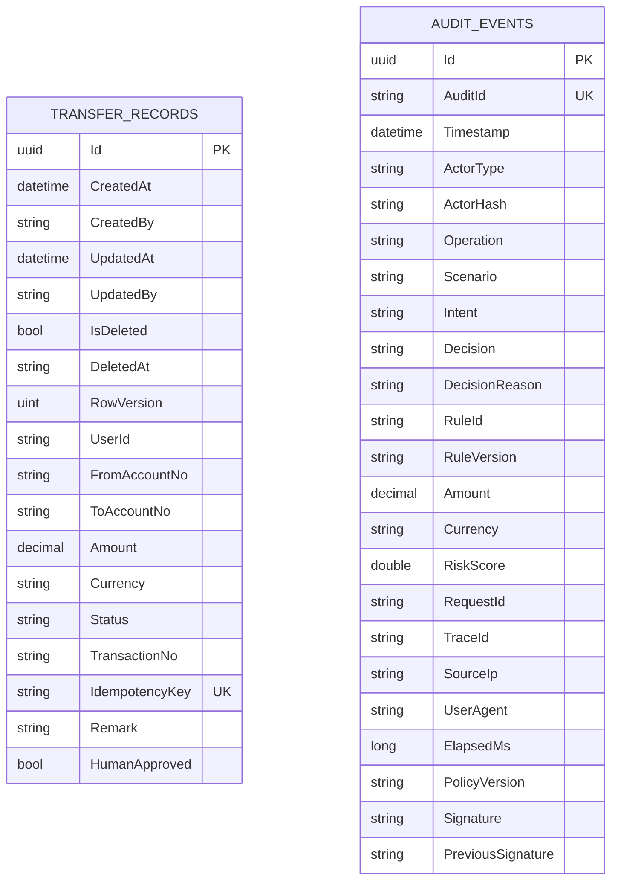
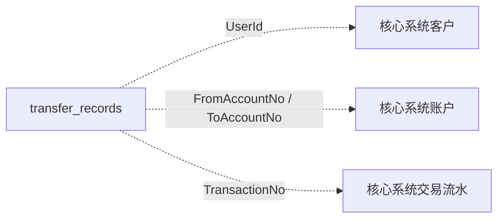

# 数据模型 — AI Banking Agent

> 本文以当前代码为准，描述业务库、审计库、插件持久化和迁移边界。
> 已实现内容标为 **Current**；尚未实现的改进标为 **Target**，两者不混写。

## 1. Current：总体模型

当前宿主加载四个插件：

| 插件 | 插件 ID | 是否贡献业务表 | 当前数据行为 |
|---|---|---:|---|
| 智能转账 | `banking.transfer` | 是 | 写入 `transfer_records` |
| 账单分析 | `banking.bill` | 否 | 读取核心系统数据，订阅转账事件 |
| 卡片管理 | `banking.card` | 否 | 查询或调用核心系统更新卡状态 |
| 理财 | `banking.wealth` | 否 | 只读产品、推荐和余额，不落插件业务表 |

此外，Base 层有独立审计存储：

- `BankingDbContext`：插件业务数据；
- `AuditDbContext`：审计数据，表为 `audit_events`；
- JSONL 审计链：默认文件 `logs/audit-chain.log`。

默认宿主配置是 SQLite + `EnsureCreated`。PostgreSQL 模型、设计时插件发现、插件 Schema 映射和 `Migrate` 初始化路径均已实现。

## 2. Current：ER 图



两张表没有数据库外键：

- `transfer_records` 属于业务库的 `BankingDbContext`；
- `audit_events` 属于独立 `AuditDbContext` 和独立数据库；
- `RequestId`、审计流水号等只形成逻辑关联；
- 账户、客户和卡片的权威数据在核心系统，不在插件数据库中。

## 3. Current：`transfer_records`

### 3.1 基类字段

`TransferRecord` 继承 `BaseEntity`，包含 8 个公共字段：

| 字段 | C# 类型 | 必填 | 当前行为 |
|---|---|:---:|---|
| `Id` | `Guid` | 是 | 客户端 `Guid.NewGuid()`；`ValueGeneratedNever()`；主键 |
| `CreatedAt` | `DateTimeOffset` | 是 | 新增时由 `BankingDbContext` 写入 |
| `CreatedBy` | `string?` | 否 | 新增时写当前用户，缺失时为 `system` |
| `UpdatedAt` | `DateTimeOffset?` | 否 | 修改时写入 |
| `UpdatedBy` | `string?` | 否 | 修改时写入 |
| `IsDeleted` | `bool` | 是 | 软删除标记；当前未见统一删除转换逻辑 |
| `DeletedAt` | `string?` | 否 | 当前类型仍为字符串 |
| `RowVersion` | `uint` | 是 | 配置为并发令牌；未配置数据库生成策略 |

`ApplyAuditFields` 会在 `SaveChanges` / `SaveChangesAsync` 前填充创建和修改字段，并阻止修改既有的 `CreatedAt`、`CreatedBy`。

### 3.2 转账字段

| 字段 | C# 类型 | 约束/索引 | 数据保护 |
|---|---|---|---|
| `UserId` | `string` | `(UserId, CreatedAt)` 复合索引 | `[Encrypted(Searchable = true)]`，确定性加密以支持等值查询和索引 |
| `FromAccountNo` | `string` | 必填 | `[Encrypted]`，随机加密 |
| `ToAccountNo` | `string` | 必填 | `[Encrypted]`，随机加密 |
| `Amount` | `decimal` | `HasPrecision(18, 2)` | 未标记 `[Encrypted]` |
| `Currency` | `string` | 默认 `CNY` | 未标记 `[Encrypted]` |
| `Status` | `string` | 默认 `Pending` | 未标记 `[Encrypted]` |
| `TransactionNo` | `string?` | 当前无唯一索引 | 未标记 `[Encrypted]` |
| `IdempotencyKey` | `string?` | 唯一索引 | `[Encrypted(Searchable = true)]`，确定性加密 |
| `Remark` | `string?` | 当前无数据库长度限制 | `[Encrypted]`，随机加密 |
| `HumanApproved` | `bool` | 默认 `false` | 未标记 `[Encrypted]` |

当前不是“L3 全部明文”。`TransferRecord` 已有 5 个 `[Encrypted]` 字段：

1. `UserId`
2. `FromAccountNo`
3. `ToAccountNo`
4. `IdempotencyKey`
5. `Remark`

`BankingDbContext` 会扫描这些特性并安装 EF Core `ValueConverter`。需要等值查询的字段使用确定性加密；其他字段使用随机加密。未标记字段不应被误写成“已加密”。

### 3.3 索引

| 索引 | 类型 | 用途 |
|---|---|---|
| `PK_transfer_records` | 主键 | 按 `Id` 定位 |
| `IX_transfer_records_IdempotencyKey` | 唯一 | 幂等键去重 |
| `IX_transfer_records_UserId_CreatedAt` | 非唯一复合索引 | 按用户和时间查询 |

`IdempotencyKey` 当前为可空字符串；SQLite 与 PostgreSQL 都允许唯一索引中出现多个 `NULL`。业务代码应继续保证实际转账记录使用非空幂等键。

### 3.4 逻辑引用



这些关系不建立外键，原因是数据权威和生命周期属于核心系统。插件库保存的是转账执行记录，不能通过级联删除清除历史。

## 4. Current：`audit_events` 与 JSONL 双写

审计已经落库，不是规划表。`AuditLogger.WriteAsync` 的顺序是：

```text
构造链式签名 → 写 JSONL 文件 → 写 IAuditRepository / audit_events
```

文件提供离线证据链，数据库提供按操作者哈希、场景和时间检索的能力。数据库写入失败不会回滚业务流程，但会记录 `Critical` 日志。

### 4.1 审计库隔离

`AuditDbContext` 使用从业务连接串派生的独立连接串：

- SQLite：`bankingagent.db` → `bankingagent.audit.db`；
- PostgreSQL：业务数据库名追加 `_audit`，表位于 `audit` Schema；
- 也可通过 `Database:AuditConnectionString` 显式配置。

业务迁移和审计初始化是两条路径：

- `BankingDbContext`：支持 `EnsureCreated` 与 Migration；
- `AuditDbContext`：当前由 `DatabaseInitializer` 调用 `EnsureCreatedAsync()`。

### 4.2 审计字段与索引

`audit_events` 的关键字段包括：

- 身份：`AuditId`、`ActorType`、`ActorHash`；
- 决策：`Operation`、`Scenario`、`Intent`、`Decision`、`DecisionReason`、`RuleId`；
- 追踪：`RequestId`、`TraceId`、`ElapsedMs`；
- 合规：`Amount`、`RiskScore`、`PolicyVersion`；
- 完整性：`Signature`、`PreviousSignature`。

当前索引：

- `Timestamp`；
- `(ActorHash, Timestamp)`；
- `(Scenario, Timestamp)`；
- `AuditId` 唯一索引；
- `RequestId`。

文件和数据库均保存操作者 ID 的哈希，不保存明文 `ActorId`。仓储接口不暴露 UPDATE/DELETE。

## 5. Current：Provider 与插件分区

### 5.1 SQLite

SQLite 不支持 PostgreSQL 式 Schema。当前所有插件业务表位于业务数据库主空间；审计表位于独立的审计数据库文件。默认开发配置使用：

```json
{
  "Provider": "Sqlite",
  "InitMode": "EnsureCreated"
}
```

### 5.2 PostgreSQL

`BankingDbContext.OnModelCreating` 会：

1. 调用每个 `IEntitySetContributor.ConfigureModel`；
2. 找出该贡献器新注册的实体；
3. 将这些实体显式映射到贡献器的 `PartitionName`。

转账贡献器的分区是 `plugin_transfer`，所以 PostgreSQL 目标表是：

```text
plugin_transfer.transfer_records
```

`DatabaseInitializer` 在 `Migrate` 前创建所需 Schema，并校验 Schema 名，防止把未验证标识符拼接进 DDL。

### 5.3 设计时插件发现

`DesignTimeFactory` 默认按 PostgreSQL 构建设计时模型，并扫描已构建插件 DLL 中的贡献器。当前只有转账插件注册 `IEntitySetContributor`；账单、卡片、理财不会产生空表。

迁移位于：

```text
src/src/BankingAgent.Base/Data/Migrations
```

已有基线迁移：

```text
20260928074506_InitialSchema
```

## 6. Current：初始化与迁移边界

| 模式 | 业务库行为 | 审计库行为 | 主要用途 |
|---|---|---|---|
| `EnsureCreated` | `BankingDbContext.EnsureCreatedAsync()` | `AuditDbContext.EnsureCreatedAsync()` | 默认 SQLite 开发/演示 |
| `Migrate` | 确保插件 Schema 后执行 `MigrateAsync()` | `AuditDbContext.EnsureCreatedAsync()` | PostgreSQL/生产化路径 |
| `None` | 不初始化 | 不初始化 | 外部部署流程或 DBA 管理 |

`EnsureCreated` 创建的数据库没有 `__EFMigrationsHistory`，不能把它描述成“迁移已应用”。健康检查只在 `Migrate` 模式下把待应用迁移作为运维信号。

详细命令和 CI 门禁见 [`../13-database/01-migration-and-ci.md`](../13-database/01-migration-and-ci.md)。

## 7. Current：已知约束

以下是当前代码中仍需关注的边界，不等于功能不存在：

1. `RowVersion` 只有并发令牌配置，没有数据库自动递增/生成策略。
2. `DeletedAt` 仍为 `string?`，且未实现统一软删除转换与全局查询过滤。
3. `TransactionNo` 没有唯一索引。
4. `IdempotencyKey` 可空，数据库唯一索引不能阻止多条 `NULL`。
5. `Amount` 等未标记 `[Encrypted]` 的字段不会由字段加密转换器处理。
6. `[Encrypted(Searchable = true)]` 使用确定性加密，会泄露“两个密文是否来自相同明文”的等值关系；只应用于确需查询/索引的字段。
7. `AuditDbContext` 目前没有独立 Migration，仍由 `EnsureCreated` 初始化。
8. JSONL 与数据库双写不是分布式事务；数据库写失败时文件可能已有记录。
9. 当前只有一个业务表贡献器，尚未以多个持久化插件做生产规模验证。

## 8. Target：后续数据模型增强

以下为目标项，不属于 Current：

- 为审计库建立独立迁移历史；
- 对 `TransactionNo` 增加唯一约束，并评估已有数据；
- 将 `IdempotencyKey` 改为必填并限制长度；
- 为 `Remark` 增加数据库长度约束和输入内容治理；
- 完成软删除过滤、删除时间类型统一和并发版本生成；
- 根据威胁模型评估 `Amount`、操作人字段等是否需要额外加密；
- 引入 outbox，保证业务记录与领域事件的原子提交；
- 为审计双写增加补偿队列、对账和告警闭环；
- 增加第二个持久化插件，验证多 Schema 迁移、权限和恢复流程。

目标 ER 图在落地前不应混入当前 ER 图，以免把规划表误当成可查询的现有表。

## 9. 关联资料

- 迁移与 CI：[`../13-database/01-migration-and-ci.md`](../13-database/01-migration-and-ci.md)
- 架构决策：[`02-architecture-decision-record.md`](02-architecture-decision-record.md)
- UML 图集：[`01-uml-diagrams.md`](01-uml-diagrams.md)
- 数据分级：[`../05-security-compliance/03-data-classification.md`](../05-security-compliance/03-data-classification.md)
- 审计日志：[`../05-security-compliance/04-audit-logging.md`](../05-security-compliance/04-audit-logging.md)
- 插件接入：[`../plugin/01-plugin-onboarding-guide.md`](../plugin/01-plugin-onboarding-guide.md)
